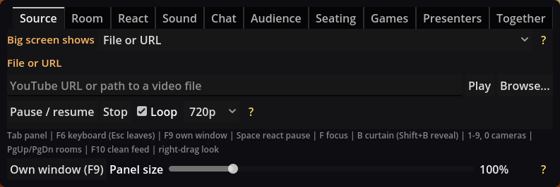
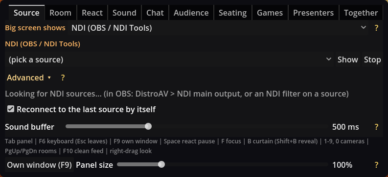
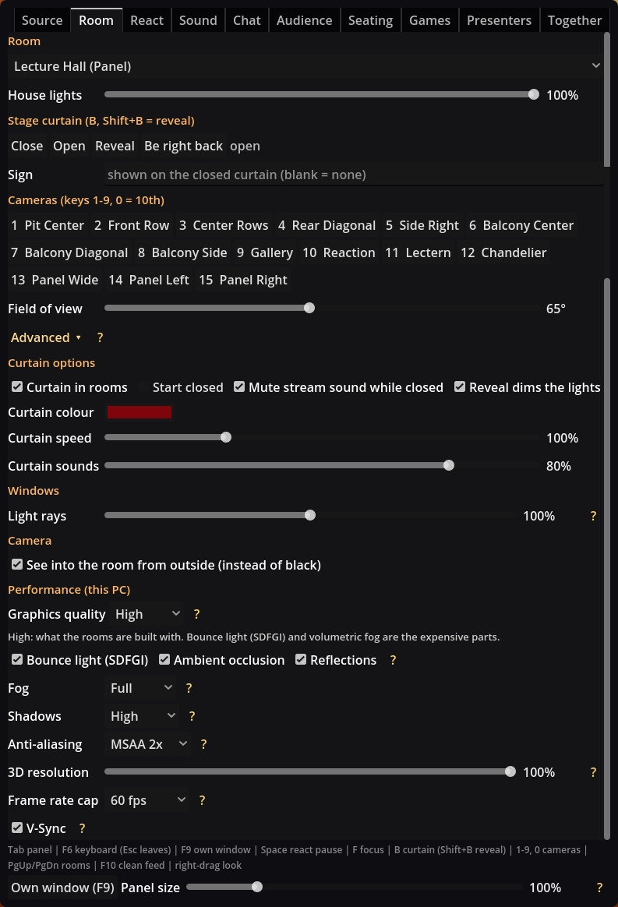
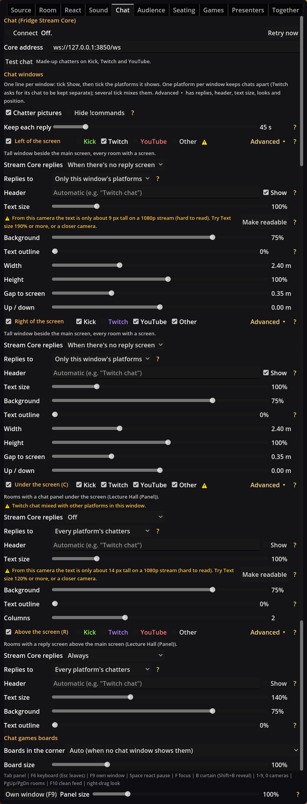
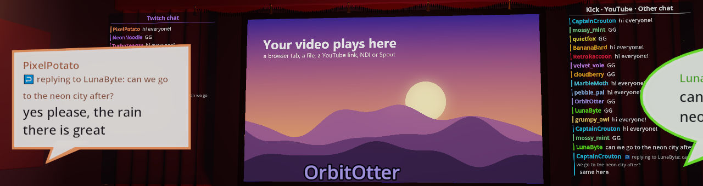
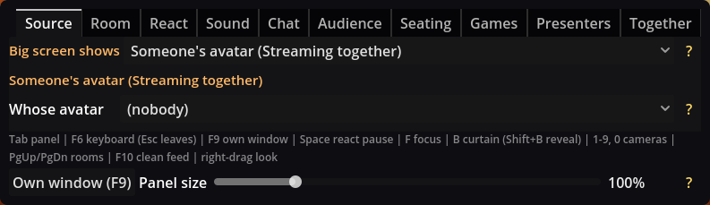
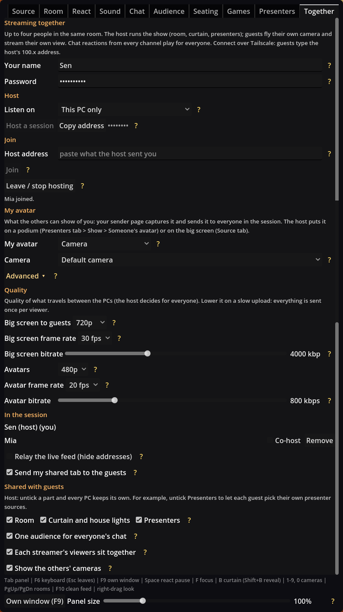

# Stream Rooms and Stream Core: user manual

*October 2026 (updated 10 October). Stream Rooms 2026.10.4 and Fridge Stream Core.*

Stream Rooms puts your stream in a 3D room: a big screen shows a browser tab, a video or another program, the screen lights the room, and your chat sits in the seats as an audience. Fridge Stream Core is the companion program that reads your Kick, Twitch and YouTube chat and decides what chat is allowed to do (points, reactions, games). You capture the Stream Rooms window in OBS and stream it.

All the pictures in this manual come from the real apps. The video on the screen is a stand-in picture, and the chatters are made up.

## What's new (October 2026)

Since the 7 October manual. Some pictures were taken before these changes, so a few controls look a little different in the app.

**Stream Rooms**

- **Messages stay off your stream.** Messages like "Address copied" or a download error now go to a **message line** at the bottom of the panel instead of onto the room picture. **Show messages on the picture** puts them back on the picture if you want that. See [The control panel](#5-the-control-panel).
- **Status strip** above the tabs: three dots for **Core**, **Big screen** and **Together**, so you see straight away when Stream Core drops or the browser tab stops. The Source tab also says what is **On the big screen now**.
- **Video downloads** show a running clock, say why they failed in plain words and have a **Try again** button.
- **Busy chat:** the **Bubbles show** filter on the Audience tab (text, emote-only, paid, highlighted, replies), an **Animated emotes** switch and a **Busy chat: paid and highlighted** button. **Most chatters in crowd** starts at 300 for new installs.
- **Highlighted and paid messages stand out:** Twitch highlighted messages get a purple bubble, Super Chats, Kicks and Bits a gold one. **Bubble colours** can be dark.
- **Chatter pictures** come from Stream Core now (Kick, Twitch and YouTube), with one hide list shared with Core and a quick **Hide a picture...** picker.
- **Animated emotes** from Twitch, 7TV and FrankerFaceZ move in the bubbles and chat windows.
- **Red-flagged chatters** (set up in Stream Core) leave their seat and the chat windows.
- **Chat box on the picture** (Chat tab), off by default (**Never**).
- **Empty all seats** (it was **Clear**) asks first, and so do the seating presets and stopping a session with guests.
- **Every control has help:** a tooltip and a yellow **?**. More settings moved under **Advanced ▸** folds (Audience, Sound, React), **Screen light** and **Screen glow** moved to the Room tab, and the chat games boards to the Games tab.
- **Streaming together** is safer: passwords need 8 characters, at most 3 guests, and joining pauses for a minute after five wrong passwords. **Both PCs need this update** to stream together.

**Stream Core** (details in Part 3)

- Chatter profile pictures saved and served by Core, and **Connect Twitch** to get Twitch pictures.
- Red flags (their own page), with **Check past chat**.
- Status and Live controls say **why** a platform isn't connected, and Core keeps retrying by itself. A **YouTube live video** box on Live controls, and a **Restart Core now** button.
- A **Customise** button for every overlay on **Sources & overlays**.
- Games (Minecraft, Factorio, Granvir, OpenTTD) are now plugins you add yourself (**Settings → Game plugins**).

## Contents

- [What's new (October 2026)](#whats-new-october-2026)

**Part 1: Getting started**

- [1. What you need](#1-what-you-need)
- [2. Starting both apps](#2-starting-both-apps)

**Part 2: Stream Rooms**

- [3. The rooms](#3-the-rooms)
- [4. Hotkeys](#4-hotkeys)
- [5. The control panel](#5-the-control-panel)
- [6. Source: what the screen shows](#6-source-what-the-screen-shows)
- [7. Room: look, curtain, cameras, performance](#7-room-look-curtain-cameras-performance)
- [8. React and Sound](#8-react-and-sound)
- [9. Chat windows](#9-chat-windows)
- [10. The audience](#10-the-audience)
- [11. Seating by platform](#11-seating-by-platform)
- [12. Chat reactions and flashing lights](#12-chat-reactions-and-flashing-lights)
- [13. Presenters, name tags and podium pictures](#13-presenters-name-tags-and-podium-pictures)
- [14. Streaming together](#14-streaming-together)
- [15. Accessibility](#15-accessibility)

**Part 3: Stream Core**

- [16. The admin dashboard](#16-the-admin-dashboard)
- [17. Connecting chat platforms](#17-connecting-chat-platforms)
- [18. Points and chat history](#18-points-and-chat-history)
- [19. Chat reactions setup](#19-chat-reactions-setup)
- [20. Chat games](#20-chat-games)
- [21. Commands, credits, alerts and overlays](#21-commands-credits-alerts-and-overlays)

**Part 4: Help**

- [22. Troubleshooting](#22-troubleshooting)
- [23. Quick reference](#23-quick-reference)

---

# Part 1: Getting started

## 1. What you need

- **Windows PC** with a decent graphics card. Stream Rooms is built on Redot (a Godot-based engine) and uses the Forward+ renderer.
- **Stream Rooms**: either the exported folder (`StreamRooms.exe` with its `tools` folder), or the project opened in Redot 26.2.
- **Fridge Stream Core** (optional but recommended): a Python program. It needs Python 3.10 or newer. Without it, Stream Rooms still works, but there is no chat audience, no reactions and no chat games.
- **A browser** (Brave, Chrome or Edge) for the sender page that shares a tab with the game. Firefox can't share tab audio.
- **OBS** (or similar) to capture the Stream Rooms window.
- Optional extras: the **NDI Runtime** for NDI sources, **Spout** output in VTube Studio / OBS / TouchDesigner, and **Tailscale** or the bundled **Cloudflare tunnel** for streaming together.

The `tools` folder holds `ffmpeg.exe` and `yt-dlp.exe` (for videos and YouTube links) and `cloudflared.exe` (for the Cloudflare tunnel). If they are missing, right-click `tools\get_tools.ps1` and pick *Run with PowerShell*. It downloads all three.

## 2. Starting both apps

1. **Start Stream Core** first. Double-click **START Stream Core.bat** (or `start.bat` inside the `fridge-stream-core` folder). A console window opens and stays open while it runs. The first time, run `install.bat` once; it sets Python up and offers a short setup wizard (your Kick channel, admins and an admin password called the *admin token*).
2. **Start Stream Rooms** (`StreamRooms.exe`, or press **F5** in Redot). The control panel shows in the top-left corner.
3. In Stream Rooms, the **Core** dot in the status strip above the tabs turns green, and the **Chat** tab says **Connected to Stream Core.** If you start Core later, Stream Rooms connects by itself.
4. Open the Stream Core dashboard in your browser at `http://127.0.0.1:3850/admin/` and paste your admin token in the header.
5. In OBS, add a **Window Capture** (or Game Capture) of Stream Rooms. Press **F9** to move the control panel into its own window so it never shows on stream, or **F10** for a clean feed.

Both apps only listen on your own PC (`127.0.0.1`). Nothing is opened to the internet unless you host a Together session.

---

# Part 2: Stream Rooms

## 3. The rooms

Pick a room in the **Room** tab, or press **PgUp / PgDn** to step through them. Every room has a main screen, a stage curtain and a set of camera spots (keys **1-9** and **0**).

**Home Theater.** A small cinema with red seats. Chat sits in the rows in front of you, with the chat windows beside the screen.

**Drive-In (1950s).** A night parking lot with a moon, stars, clouds, a pickup with lawn chairs, a concession stand and a projector beam.

**Neon City (night).** A rain-soaked city avenue. The screen is a giant LED billboard on a tower; every window in every building is a little lit room. The Room tab adds **Rain** and **Hologram** controls here (under **Advanced ▸**).

**Old Classroom (film day).** A 1950s classroom with a roll-down screen, a 16 mm projector that whirrs, an old-film look on the picture and a tinny speaker. **Film look** (Room tab ▸ Advanced) and **Speaker FX** (Sound tab ▸ Advanced) set how strong the old look and sound are.

**Lecture Hall.** A Victorian Gothic university theatre in dark oak with stained glass, sunbeams, a ring chandelier, two balconies and a crowd of about 680 extra seats. **Light rays** (Room tab ▸ Advanced) sets how visible the sunbeams are. It has 12 cameras.

From the balcony you see the *filler crowd*: muted people who sway, dim with the house lights and join in crowd reactions. Your chatters take their places as the room fills.

**Lecture Hall (Panel).** The lecture hall with four oak podiums for presenters, a smaller screen higher up, a **chat screen** under the main screen and a **reply screen** above it for Stream Core's answers.

**Studio.** A plain test room without a webcam frame (your webcam shows as a corner overlay there).

## 4. Hotkeys

| Key | What it does |
|---|---|
| **Tab** | Show / hide the control panel |
| **Space** | Pause to react: pauses the video (or sends Play/Pause to the browser), brings the lights up and moves to the Reaction camera |
| **F** | Focus view: the video flat and full-frame, so viewers can read it |
| **B** / **Shift+B** | Close / open the stage curtain; Shift+B is the big reveal |
| **1-9, 0** | Camera spots (0 is the 10th) |
| **PgUp / PgDn** | Previous / next room |
| **C** / **R** | Chat screen / reply screen on or off (rooms that have them) |
| **F9** | Control panel in its own window, or back |
| **F10** | Clean feed: hides all on-screen UI |
| **F11** | Fullscreen |
| **F6** | Work the panel with the keyboard (Esc leaves) |
| **Ctrl+= / Ctrl+-** | Panel bigger / smaller |
| Hold right mouse + move, **WASD**, **Q/E**, Shift | Free-look camera (Q down, E up, Shift = faster); the mouse wheel while right-dragging zooms |

Hotkeys are ignored while you type in a text box. Press Esc to leave the box.

## 5. The control panel

The panel sits over the room in the top-left corner. Its tabs are **Source, Room, React, Sound, Chat, Audience, Seating, Games, Presenters** and **Together**. Every tab scrolls.

<!-- picture outdated: taken before the status strip above the tabs and the message line at the bottom of the panel -->

### Status strip and message line

**The status strip** sits above the tabs on every tab. It has three coloured dots:

| Dot | Green | Amber | Red | Grey |
|---|---|---|---|---|
| **Core** | Stream Core is connected | | **Core not connected**: chat, bubbles and reactions stop | **Core off** (the Chat tab's **Connect** is off) |
| **Big screen** | Something is showing (**Big screen: tab**, **video**, **NDI**, **Spout**) | **Big screen empty** | **Big screen: tab stopped** (the browser tab stopped sending) | |
| **Together** | **Hosting** (with the number of guests) or **Joined** | Someone is waiting to join, or you are **Joining...** | **Together: problem** | **Together off** |

Click a dot to jump to its tab (Chat, Source or Together).

**The message line** at the bottom of the panel shows the app's latest message, for example "Address copied" or why a video didn't load. Problems are red. Click it (or **Messages ▸**) to see the last 10 with their times. When Stream Core drops, or the browser tab stops sharing, a message says so.

Messages no longer show on the room picture, because that is the window OBS captures. If you liked them there, tick **Show messages on the picture** (under **Messages ▸**): each message then also shows for a few seconds at the bottom of the picture. Clean feed (F10) hides them either way.

### Everywhere in the panel

- **Help on every control.** Hover over any control for a tooltip. **The yellow ?** beside it shows the same help as a line of text under it, which is easier to read and works with the keyboard.
- **Click a number** next to a slider (for example *75%*), type a value and press Enter for an exact setting.
- **Own window (F9)** at the bottom moves the panel into a separate window. Put it on your second monitor; then a window capture in OBS never shows it. It remembers where you left it.
- **Panel size** (bottom) makes everything 75% to 200% as big. Ctrl+= and Ctrl+- do the same.
- **Advanced ▸**: every tab shows the controls you use while streaming. The set-up-once settings sit under an **Advanced ▸** button, closed until you click it (it turns into **Advanced ▾**). What you open stays open next time. Nothing was taken away; it just folds out of the way. The Room, React, Sound, Audience and Together tabs each have one, and so does each chat window and each podium picture.
- **Asks first.** Things a misclick can't undo ask before they happen: **Empty all seats**, a seating preset that would replace a plan you made by hand, and **Leave / stop hosting** while guests are in. The question opens as its own small window, so it never shows on stream.
- Settings save by themselves. If the app crashes in the middle of a save, the next start uses the copy from the save before.

## 6. Source: what the screen shows

The Source tab shows one source at a time. **Big screen shows** picks **Browser tab (sender page)**, **NDI (OBS / NDI Tools)**, **Spout (programs on this PC)**, **File or URL** or **Someone's avatar (Streaming together)**, and only that source's controls appear below it. It follows whatever starts playing and remembers your last pick. Picking one there only changes which controls you see, not the screen: press **Show** or **Play** in that section (or share a tab from the sender page). Each source's help text and its "by itself" ticks are under its **Advanced ▸**.

The line under it, **On the big screen now:**, always says what is really showing, whichever controls are open: for example *Browser tab, "YouTube - ..." (30 fps)*, *NDI, OBS (MAIN)* or *Nothing.*

<!-- picture outdated: taken before the "On the big screen now:" line and the status strip -->

**Only your sender page can use the big screen.** Each time Stream Rooms starts it makes a new secret key and writes it into the sender page, and it only takes pictures and sound from a page with that key. Another website open in your browser can't put its own picture on your big screen. Nothing changes for you: open the page with **Open sender page** (or your bookmark) as before. A sender page left open while you restart Stream Rooms picks up the new key by itself.

### A browser tab (recommended)

1. Click **Open sender page**. It opens `http://127.0.0.1:8765/` in your browser.
2. Click **Share a tab or window**, pick the tab (for example YouTube) and leave **Share tab audio** on.
3. The tab shows on the big screen within a second or two. Keep the sender page open. It can sit behind other tabs, but don't minimise the whole browser window.

The sender page also has:

- **Quality** and **FPS** for the shared tab, and **Send tab audio to the game**.
- **Start webcam**: your webcam shows on the room's picture frame, or as a corner overlay in rooms without one.
- **My avatar**: when you stream together, it captures the avatar you picked in the Together tab and sends it to the others (see [Avatars](#avatars-on-podiums-and-the-big-screen)). A camera starts by itself; a tab or web page needs a click here.
- **Presenter feeds**: one row per podium for cameras, tabs and web pages (see [Presenters](#13-presenters-name-tags-and-podium-pictures)).
- **Streaming together** status: when you host, it says your guests get your shared tab too.

In a Streaming together session the host can put someone's avatar on the big screen instead: see [Avatars](#avatars-on-podiums-and-the-big-screen).

**No double sound.** The sender page asks the browser to silence the shared tab and sends its sound to the game instead. If the browser can't, both the sender page and the Source tab warn you; then mute the tab yourself.

### A video file or YouTube link

Pick **File or URL** in **Big screen shows**. Type a file path or a web link and click **Play**, or click **Browse...**. Links and non-`.ogv` files are converted first with yt-dlp and ffmpeg (the `tools` folder), at the height picked next to **Loop** (720p by default). **Pause / resume**, **Stop** and **Loop** control playback.

While a video downloads or converts, a line under the controls says so with a running clock ("Downloading... 1:12", "Converting... 0:40"), then "Ready". If it fails, the line says why in plain words (for example that yt-dlp may be out of date, or the video is private or age-restricted) with a **Try again** button; what yt-dlp and ffmpeg printed is under **Details ▸**, for when you ask for help. Nothing about it shows on stream.

Downloads are limited to 2 GB and 4 hours per video, so a link can't fill your disk. Closing the app during a download stops it straight away.

### NDI (OBS / NDI Tools)

Lighter than the sender page: OBS does the encoding. Install **DistroAV** in OBS and turn on its NDI output (or add an NDI Filter to one source). Then pick **NDI (OBS / NDI Tools)** in **Big screen shows**, choose the source and click **Show**. **Stop** lets go. The status line right under the picker says what's going on (plugin missing, no sources found, what's showing).

Under **Advanced ▸**:

- **Sound buffer** (default 500 ms) rides out hiccups but puts the sound that far behind. Lower it if lip-sync matters more.
- **Reconnect to the last source by itself** brings it back when OBS starts later.
- Needs the free **NDI Runtime**. Without it, the status line says the plugin isn't loaded and everything else still works.

### Spout (programs on this PC)

Shows another program's picture straight from the graphics card, with no delay or blur, and with transparency: VTube Studio, OBS with the Spout2 plugin, TouchDesigner and some games. Pick **Spout (programs on this PC)** in **Big screen shows**, choose the sender and click **Show**; the status line under the picker says what's showing. Spout carries no sound. **Show the last sender again by itself** (under **Advanced ▸**) brings it back when the program restarts.

### Lip-sync

The picture takes a longer path than the sound, so the sound is held back 150 ms by default. Change **Audio delay** or **Video delay** under the Sound tab's **Advanced ▸**.

## 7. Room: look, curtain, cameras, performance

On top, the things you use while streaming:

- **Room**: pick the room. **House lights** dims the room's lamps and chandeliers by hand.
- **Stage curtain**: **Close**, **Open**, **Reveal**, **Be right back** and the **Sign** text (see below).
- **Cameras**: one button per camera spot, the same as keys 1-9 and 0.
- **Field of view** (25-110°, default 65).

Under **Advanced ▸**: the **Curtain options**, **Big screen light**, the room's own looks, **See into the room from outside (instead of black)**, and the whole **Performance (this PC)** block.

<!-- picture outdated: taken before Screen light and Screen glow moved here from the Sound tab (the "Big screen light" heading) -->

- **Big screen light**: **Screen light** (how much light the big screen throws into the room, onto the seats, walls and audience) and **Screen glow** (how bright the picture itself glows). They used to be on the Sound tab.
- **Room looks** appear for some rooms: **Light rays** (Lecture Halls), **Rain** and **Hologram** (Neon City), **Film look** (Old Classroom).
- **See into the room from outside (instead of black)**: if you fly the camera out through a wall, the wall is cut away instead of everything going black.

### Stage curtain

A red velvet curtain hangs in front of every main screen.

- **Close** (or **B**) hides your screen: the picture, its light on the room and (with **Mute stream sound while closed**) the sound. Focus view shows the curtain too. **Open** opens it.
- **Reveal** (or **Shift+B**): lights down, a spotlight, a drum roll, and the curtain sweeps open.
- **Sign** puts text on a board on the closed curtain. **Be right back** fills in the sign and closes it.
- **Start closed** (under Advanced) starts the app behind the curtain, ready for a reveal when you go live.
- Under **Advanced ▸**, **Curtain options**: **Curtain in rooms** (off = no curtain at all), **Start closed**, **Mute stream sound while closed**, **Reveal dims the lights**, **Curtain colour**, **Curtain speed** and **Curtain sounds**.
- Mods can run it from chat with `!curtain open`, `!curtain close` or `!curtain reveal` (chat games on), and you can run it from Stream Core's **Live controls** page.

### Performance (this PC)

Under the Room tab's **Advanced ▸**. These are remembered on this PC, not per room.

- **Graphics quality**: **High** (what the rooms are built with), **Medium** (no bounce light, lighter fog and shadows), **Low** (also no fog, ambient occlusion or reflections, and draws the 3D at 75% scaled up with FSR). Changing any of the switches below it makes it **Custom**.
- **Frame rate cap**: 30, 60 (default) or Unlimited. Set it to your stream's frame rate; a 144 Hz screen otherwise makes the graphics card draw far more frames than the stream needs.
- **V-Sync** stops tearing on your own screen.
- **On a laptop**: start on Medium or Low, cap the frame rate, set **Most chatters in crowd** (Audience tab ▸ Advanced) to about 100-150, run plugged in, and make sure Redot and OBS use the NVIDIA graphics card.

## 8. React and Sound

<!-- picture outdated: taken before Talk threshold and Duck by moved under the React tab's Advanced fold -->

The **React** tab has buttons for **Pause to react (Space)**, **Focus view (F)** and **Clean feed (F10)**, and what a react pause does: **Raise the lights while paused**, **Jump to the Reaction camera while paused**, **Dim room lights while playing**, and **Show webcam in the room (off = corner overlay)**.

**Auto-duck when I talk**: with **Lower the video while the mic hears me** on, the video's sound drops while you speak. Watch the **Mic** meter; it says "ducking" while the video is lowered, or **No microphone** when auto-duck can't hear you. Under **Advanced ▸**, set **Talk threshold** just below your speaking level; **Duck by** sets how far it drops (14 dB by default). If starting the microphone ever froze the game, the next start turns this off and tells you; **Start without microphone.bat** next to an exported game does the same on purpose.

<!-- picture outdated: taken before the Sound tab got its Advanced fold and before Screen light / Screen glow moved to the Room tab -->

The **Sound** tab: **Video volume** and **Room ambience** on top. Under **Advanced ▸**: **Room acoustics** (the room's echo), **Speaker FX** (the old speaker sound in rooms that have one), and **Audio delay** and **Video delay** for lip-sync. **Screen light** and **Screen glow** moved to the Room tab's **Advanced ▸**.

## 9. Chat windows

<!-- picture outdated: taken before the chat games boards moved to the Games tab, before "Chatter pictures" here was renamed "Pictures in chat windows", and before the "Chat box on the picture" section -->

At the top: **Connect** (to Stream Core) with a line that says **Connected to Stream Core.** or what it's waiting for, **Retry now**, the **Core address** and **Test chat** (made-up chatters, to try things without going live).

Under **Chat windows**, three settings apply to every window: **Pictures in chat windows** (chatters' profile pictures next to their names), **Hide !commands** (leave `!tomato` and the like out of the windows) and **Keep each reply** (how long a Stream Core reply stays up; 0 = until newer ones push it off).

Twitch asks for its chat to be kept apart from other platforms' chat, so every chat window picks its own platforms. There are four windows:

- **Left of the screen** and **Right of the screen**: tall windows beside the main screen, in every room. By default the left one shows Twitch and the right one Kick, YouTube and other.
- **Under the screen (C)**: the chat screen (Lecture Hall (Panel)).
- **Above the screen (R)**: the reply screen for Stream Core's answers (Lecture Hall (Panel)).

Each window is one line in the Chat tab: the tick with its name (**Left of the screen**, **Right of the screen** ...) that shows or hides it, the platform ticks (**Kick**, **Twitch**, **YouTube**, **Other**), a small ⚠ when its text would be too small to read on stream (click it to open that window's settings, where **Make readable** is), and **Advanced ▸** for the rest.

- **The platform ticks**: tick one platform to give it a window of its own, or several to mix them. None ticked = no chat in that window. A warning shows (under Advanced) when Twitch is mixed with others.
- **Advanced ▸** opens the rest of that window's settings (remembered):
  - **Stream Core replies**: *Off*, *Always*, or *When there's no reply screen*. **Replies to**: *Every platform's chatters* or *Only this window's platforms*.
  - **Header**: a title line; leave it empty to name it after what it shows ("Twitch chat").
  - **Text size**, with the readability warning and a **Make readable** button that sets the size it suggests for a 1080p stream from the camera in use.
  - **Background**, **Text outline** and **Columns**, and for the side windows **Width**, **Height**, **Gap to screen** and **Up / down**.

<!-- picture outdated: taken before the side windows got Columns, before "Chatter pictures" here became "Pictures in chat windows", and with the chat games boards still at the bottom (now on the Games tab) -->

**Replies.** A message sent with Kick's or Twitch's reply button shows a small "↩ replying to *Name*: what they said" line under the chatter's name, in the chat windows and in their speech bubble. YouTube live chat has no reply button, so its messages never have one. In a Streaming together session with one shared audience, guests see the reply lines too.

**Paid and highlighted messages** get a coloured box in the chat windows too: gold for Super Chats, Kicks and Bits, purple for Twitch messages highlighted with channel points (see [The audience](#10-the-audience)).

**Chat games boards** moved to the **Games** tab (see [Chat reactions and flashing lights](#12-chat-reactions-and-flashing-lights)).

### Chat box on the picture

A chat box in a corner of the picture itself, like the chat games boards. It isn't part of the room, so it shows from every camera, in focus view and in clean feed (it's part of the show).

- **Chat box**: *Auto (when no chat window shows chat)* puts it up only while no window in the room shows chat (for example in a room without a screen, or with the side windows off). *Always* keeps it up; *Never* (the default) turns it off.
- **Shows**: the platform ticks, the same as a chat window's.
- Under its **Advanced ▸**: **Corner** (bottom left by default; *Top right (shares it with the boards)*), **Box width** and **Box height** (shares of the picture), and the chat windows' own options: **Stream Core replies**, **Replies to**, **Header**, **Text size**, **Background**, **Text outline** and **Columns**.

## 10. The audience

When chat comes in from Stream Core, everyone who chats gets a seat: a head-and-shoulders silhouette in their colour, with their name, and a speech bubble when they talk. Kick, Twitch and YouTube chatters' profile pictures fill the head. Emotes (Twitch, BetterTTV, FrankerFaceZ, 7TV, Kick, emoji) show in the bubbles, and animated emotes move (7TV and FrankerFaceZ ones too).

<!-- picture outdated: taken before the Bubbles show filter, the Empty all seats button (was Clear), Hide a picture..., "Chatter pictures (everywhere)" and the Audience tab's Advanced fold -->

On top, what you use while live:

- **Show audience**, and how many seats are taken. **Test chat** fills seats with made-up chatters (now and then one sends a paid or highlighted message, so you can see the colours). **Empty all seats** makes everyone leave their seat; it asks first. They sit down again when they next chat.
- **New chatters sit**: *Anywhere (random)*, *Front row first, from the middle*, or *Front row first, random seat in the row*.
- **Bubble size**.
- **Bubbles show**: for a very busy chat, pick which messages get a speech bubble. Tick any mix of **Text messages** (ordinary messages with words in them), **Emote-only**, **Paid** (Super Chats, Kicks and Bits), **Highlighted** (Twitch highlighted messages and gigantified emotes) and **Replies** (messages that answer someone). Untick **Animated emotes** to show every emote as a still picture, which is lighter on the PC. A chatter whose message gets no bubble still sits down, and the chat windows always show every message. Two buttons set it in one click: **Busy chat: paid and highlighted** (only those two, with still emotes) and **Show everything** (every box ticked again).
- **Name tags** and **Chatter pictures (everywhere)**: turning pictures off here turns them off everywhere, the chat windows included. (The Chat tab's **Pictures in chat windows** only turns them off in the chat windows.)
- **Hide pictures of**: names whose picture is never shown. A name matches the display name or the login; write `kick:name` (or `twitch:` / `youtube:`) for one platform only. Mid-stream it's quicker to use **Hide a picture...** under it: it lists the people seated now, newest first, and adds them for you. This is the same list as Stream Core's **Never show a picture for**: names you add here are added there too, so Core's chat overlay hides them as well. To show someone again, take the name off in both places.

Under **Advanced ▸**:

- **Idle timeout**: minutes without chatting before someone leaves. When every seat is taken, the quietest person makes room.
- **Seat spacing**: how much room there is between seated chatters along a row, 1 m by default. Seats closer than that to a taken one stay empty, so nobody sits shoulder to shoulder. That means fewer seats than places: the Lecture Hall's front pews seat every other place (38 instead of 79), and the crowd tiers thin out the same way. 0.5 m uses every seat. The room reloads when you change it, and the "*x* / *N* seats taken" line shows the new number.
- **Bubble time**, and **Bubble colours**: *Light (white bubbles, dark text)* (the default) or *Dark (dark bubbles, light text)*. The outline keeps each chatter's colour either way.
- **Colour paid and highlighted messages** (on by default): Super Chats, Kicks and Bits get a gold bubble, and Twitch messages highlighted with channel points ("Highlight My Message") a purple one, like on Twitch. A "Gigantify an Emote" message shows its emote big. The chat windows' boxes follow this tick too.
- **Show empty seats**, **Hide !commands in bubbles**, **Regulars' titles on name tags**.
- **Ignore names**: bots that never get a seat or show in the chat windows.
- **Colours**: **Colour chatters by** their chat colour, their name, or their platform, with a colour picker per platform. **Colour-blind safe colours** / **Brand colours** switch the platform colours.
- **Crowd (Lecture Hall tiers, balcony, gallery)**: **Filler crowd** and **Crowd fullness**, **Crowd timeout**, **Most chatters in crowd** (0 shows as **No limit**; 300 for new installs; 100-150 on a laptop), **Crowd chatters move down** into free main seats, and **Filler people in empty main seats**. If you used the app before this change, your old value stays (most older setups have **No limit**): lower it if a busy chat makes the room stutter.

**Red-flagged chatters.** Stream Core's dashboard has a list of phrases (**People → Red flags**). Whoever says one is red-flagged: they leave their seat, their lines leave the chat windows, and Core sends nothing more from them. Nothing to set up in Stream Rooms; **Unflag** them in Core's dashboard to let their chat through again.

**Busy chat.** However fast chat goes, at most 16 bubbles are up at once (a new one ends the oldest), and pictures and emotes kept in memory are limited, so a long, busy stream doesn't slowly eat up the PC's memory. Chat that piles up during a hitch is worked through over the next few frames instead of all at once.

Silhouettes right in front of the camera fade out so your view stays clear, and bubbles grow with distance so you can read them from the balcony. When bubbles would overlap on screen, the newest wins: older ones slide up out of its way, and one that would have to move more than a couple of bubble heights fades out early instead. Name tags fade out on seats far from the camera, so a wide shot isn't covered in names. A reply (Kick's or Twitch's reply button) gets a small "↩ replying to *Name*" line under the name in its bubble.

## 11. Seating by platform

Keeps each platform's chatters physically apart in the audience.

- The main seats are four quadrants as the audience faces the stage: **Q1** front left, **Q2** front right, **Q3** back left, **Q4** back right. The Lecture Hall's crowd seats are sections **101-105** (lower tier), **201-205** (balcony) and **301-305** (gallery).
- Tick **Seat chatters by platform**. Click a section on the chart, then tick who **May sit here** (none ticked = anyone).
- **Keep platforms apart when their seats are full**: on, a chatter waits for a seat in their own sections; off, they sit anywhere free.
- Presets: **Anyone anywhere**, **Twitch apart (left)**, **A quadrant each**. When you made a plan by hand that a preset would change, it asks "Replace your seating plan?" first. **Re-seat everyone now** moves people already seated.
- **Floor** switches the chart between **Bottom floor** and **Top floor (balcony + gallery)**. Small dots are seats, big dots are chatters, boxes are podiums. Sections are labelled with letters (K, T, Y, O) as well as colours.

## 12. Chat reactions and flashing lights

Chat can throw things at the stage. Typing 🍅 in chat throws a tomato at the screen; `!tomato @name` aims at someone in the audience (their silhouette flinches), `!tomato presenter2` at a presenter, `!tomato podium2` at their podium, `!tomato webcam`, `!tomato chat`. `!targets` lists what the current room has.

Effects include throws (splat, bounce, stick, shatter), piles on the stage, rain, confetti, wiggles, cheering, the stadium wave, spotlights, room lights, camera shake, signs over heads, seat props (💤 🍿 📱), high fives, seat moves, cartoon stage fire and fireworks. Reactions can also throw pictures (a boot, or pictures you upload to Stream Core).

Stream Core decides who may do what (permissions, cooldowns, point costs, opt-outs); Stream Rooms plays it. If the game can't play one (for example reactions are off), Core gives the points back.

<!-- picture outdated: taken before the Chat games block (Boards in the corner, Board size) moved here from the Chat tab -->

The **Games** tab in Stream Rooms:

- **Chat reactions**: **Play reactions**, **Allow camera shake**, **Reaction size**.
- **Flashing lights (photosensitive viewers)**: **Flash strength** (0-100%): how bright flashes, police lights, flicker, fireworks and fire get. **Photosensitive-safe mode**: caps flashes at 30%, slows strobes to under 3 a second, makes FLASHBANG a soft swell and turns camera shake off. While it's on and Flash strength is set higher, a note under it says so.
- A list of effects with **Test here**, to try any effect in the current room without Stream Core.
- **Chat games** (moved here from the Chat tab): **Boards in the corner** (*Auto (when no chat window shows them)*, *Always*, *Never*) and **Board size**. Polls and other boards go on the reply screen when the room has one (and on any chat window that shows Stream Core replies), otherwise in the top-right corner.

## 13. Presenters, name tags and podium pictures

Rooms with podiums (Lecture Hall (Panel)) can show up to four presenters: guests on camera, a vtuber, a PNGtuber page, or a silhouette.

<!-- picture outdated: the sliders shown as "Move up/down", "Picture self-lit", "Move left/right" and "Move up/down" are now "Presenter up/down", "Podium picture self-lit", "Podium picture left/right" and "Podium picture up/down" -->

- **On set**: which podiums are used, numbered 1-4 from left to right as the audience sees them. **Edit presenter** picks which one the settings below are for.
- **Show**: *Silhouette*, *Green screen*, *Camera*, *Tab / window*, *Web page (transparent)*, *NDI source*, *Spout (this PC)* or *Someone's avatar (Together)* (with **Whose avatar**; see [Streaming together](#avatars-on-podiums-and-the-big-screen)). The tab only shows the rows that matter for the choice.
- **Camera** (which webcam), **Web page** (the address), or the NDI / Spout source.
- **Self-lit (light panel)** makes the picture glow on its own. **Podium light** is the reading lamp (0-300%).
- **Chroma key** for camera and tab pictures: key colour, **Key similarity**, **Key smoothness**, **Spill removal**. Turn it off for NDI and Spout pictures that already have transparency.
- **Zoom** and **Presenter up/down** frame the picture.
- **Name tag**: a name above the picture, for example their channel name.
- **Podium picture**: a logo, avatar or badge on the front of the podium. **Browse...** picks a PNG, JPG, WebP or GIF (animated GIFs play), up to 3 MB; **Clear** removes it. Once a picture is chosen, its **Advanced ▸** holds **Picture size**, **Podium picture self-lit**, **Podium picture left/right** and **Podium picture up/down**. It sticks to the podium's real front, even a slanted one.
- **Chat name**: their chat name(s), comma separated (`kick:name` only matches on Kick). That chatter sits on the podium instead of in the audience; their throws come from the podium, and their messages pop up over it. **Chat-style silhouette** gives a silhouette their chat colour, picture and name; **Chat bubbles** shows their messages.

Camera, tab and web-page pictures come through the **sender page**:

- **Cameras** start by themselves. The first time, the browser asks for camera permission (**Allow cameras**).
- **Tabs / windows**: click that presenter's **Pick a tab or window** button in the sender page.
- **Web pages (transparent)**, such as a reactive PNGtuber page: in the sender page click **1. Open page** (a small window opens with the page on the key colour), then **2. Share it** and pick the tab called *Presenter N web page*. Magenta (`#ff00ff`) is often a safer key colour than green for colourful avatars.

## 14. Streaming together

Up to four people share one room: a **host** who runs the show and up to three **guests**. Everyone runs their own Stream Rooms, flies their own camera and streams their own view from their own OBS. Only small messages travel between the PCs, so it needs almost no bandwidth (unless you share video, see below).

<!-- picture outdated: taken before the status strip; the Password hint now asks for at least 8 characters -->

**Both PCs need the October update.** Since 9 October, Together sessions only work when the host and every guest run the same new build (guests now send their chat to the host in batches). If one PC is older, joining is refused with "Different Stream Rooms versions"; the message may show the same version number on both sides, so update both anyway.

### Connecting

Nobody has to open ports on their router. Pick one way in **Listen on**:

- **Cloudflare tunnel (hide my address)**: hosting gets a one-off `something.trycloudflare.com` address. Nobody sees anybody's real address. The address is new each session, and a brand-new tunnel sometimes needs a second try from a guest.
- **Tailscale (else this PC only)**: everyone joins the host's free Tailscale network.
- **Any network** also lets PCs on your home network in. **This PC only** is for testing two copies side by side.

Then:

1. Everyone types **Your name** and the same **Password** (the host picks it, **at least 8 characters**). A shorter password you saved before this rule still works, but the Together tab asks you to pick a longer one before the next session.
2. The host clicks **Host a session**, then **Copy address**, and sends the address to the guests in a private message.
3. Each guest pastes it into **Host address** and clicks **Join**.
4. **Both of you confirm.** Once the password checks out, the host gets a popup: "Someone calling themselves "*Name*" wants to join your session. They know the password, but anyone can type any name: if you're not sure it's them, ask them first (for example on Discord). Let them in? Nothing is shared until you do.", with **Let them in** and **Decline**. At the same time the guest gets "You're connected to *Host name*. Is that who you meant to join?", with **Yes, join** and **No, leave**. The names are what each person typed in **Your name**, so check them before you say yes. Both popups open as their own small window, even while the panel sits inside the main window, so a name never shows on stream.

<!-- picture outdated: the host's popup text now starts "Someone calling themselves ..." and warns that anyone can type any name -->

Nothing is shared and nothing syncs until both of you have said yes. Until then the guest waits in line, and the status line on both sides says what it's waiting for. If either of you declines or leaves, or nobody answers within two minutes, the connection closes with a message saying why.

**Leave / stop hosting** ends your part (while you host with guests in, it asks "Stop hosting?" first). A wrong password or a different Stream Rooms version is turned away with a message saying why.

**Limits that protect the host:** at most three guests (a fourth is told "The session is full"). After five wrong passwords from one place, joining from there pauses for a minute (through the Cloudflare tunnel everyone counts as one place, so a real guest may have to wait that minute too). Pictures sent over the session (podium pictures, chatter pictures) larger than 4096 pixels either way are refused.

**Nothing leaks on stream**: the address is never shown on screen (only dots), and the password never leaves your PC (only a scrambled check of it is sent).

### What's shared

- The **room**, the **stage curtain** and its look, and the **house lights**.
- **Presenters**: who's on set, what they show, name tags and podium pictures. A web page or **Someone's avatar** podium shows for everyone. A podium showing the host's own camera, tab, NDI or Spout only exists on the host's PC, so guests see a silhouette there.
- **Chat reactions** from every channel play for everyone.

Each person keeps their own camera, graphics, sound, chat windows and Stream Core.

**Shared with guests** (host): untick **Room**, **Curtain and house lights** or **Presenters** to let every PC keep its own. Tick it again and the guests get the host's state back.

### Host and guests

Guests can't change shared things; those controls are greyed out. The host can tick **Co-host** next to a guest to let them change the room, curtain and presenters too, or click **Remove**. **Show the others' cameras** shows a small floating camera with each person's name.

Every guest draws the whole room while streaming. When a guest joins on High or Custom graphics, the tab offers **Use Medium** (or **No thanks**).

### One audience for everyone's chat

With **One audience for everyone's chat** ticked (host), every streamer's viewers sit in the same audience, and every stream shows the same people in the same seats with the same bubbles. The host's seating settings decide who sits where. **Each streamer's viewers sit together** gives each streamer's viewers their own part of the room (halves for two, quarters for three or four). Each guest's own chat windows still show only their own chat.

### Watching a video together

When the host plays a **web link** in **File or URL**, everyone watches it in sync. Every PC downloads it itself (each needs the `tools` folder), everyone waits on the first frame, and the host starts them all at once. The host's pause, jumps and Stop reach everyone. A video **file** on the host's PC can't reach the guests, so only the host sees it.

### The host's live tab

With **Send my shared tab to the guests** ticked (host), the tab shared in the host's sender page also goes to the guests' big screens with its sound, through VDO.Ninja, straight from browser to browser (about 0.2 to 1 second behind). Guests open their own sender page (the **Open sender page** button in the Together tab) and click **Watch the host's live feed**. **Relay the live feed (hide addresses)** sends it through VDO.Ninja's relay servers instead, so the browsers don't see each other's addresses.

### Avatars on podiums and the big screen

Each person picks **My avatar** in their own Together tab: **Off**, **Camera** (plus which camera), **Tab / window**, or **Web page (transparent)** (plus its address, for example a reactive PNGtuber page). Their sender page captures it in its **My avatar** row and sends it to everyone in the session through VDO.Ninja. A camera starts by itself; a tab or web page needs a click in the sender page.

The host decides where avatars show, and every PC follows:

- **On a podium**: Presenters tab, set a podium's **Show** to **Someone's avatar (Together)** and pick the person under **Whose avatar** (everyone in the session, the host included). The podium's chroma key and other picture settings work as usual.
- **On the big screen**: Source tab, set **Big screen shows** to **Someone's avatar (Streaming together)** and pick the person under **Whose avatar**. Their avatar takes the big screen on every PC. It travels at the **Avatars** quality, so pick 720p there for this. **(nobody)**, or another source, goes back to the host's own.

Your own avatar shows on your PC straight from your sender page (nothing travels). If the person isn't in the session right now, their podium waits until they join. NDI and Spout can't travel this way (they live in the game, not the browser); send those to OBS and from there into a web page, for example a VDO.Ninja link.

### Quality

Under the Together tab's **Advanced ▸**. The host picks the quality for everyone (everything is sent once per viewer, so lower it on a slow upload):

| Setting | Choices | Rough upload per viewer |
|---|---|---|
| **Big screen to guests** | 480p, 540p, 720p, 1080p | 720p: 3-6 Mbps; 540p: about 2 Mbps |
| **Big screen frame rate** / **bitrate** | 15/30/60 fps; 500-10000 kbps | |
| **Avatars** | 240p, 360p, 480p, 720p | 480p: 0.5-1 Mbps; 240p: 0.2-0.4 Mbps |
| **Avatar frame rate** / **bitrate** | 15/20/30 fps; 100-3000 kbps | |

Changes apply while live.

**A note on copyright**: when several channels watch the same video together, each one is broadcasting it. Only share videos you're allowed to stream.

## 15. Accessibility

- **Panel size** 75-200% (Ctrl+= / Ctrl+-).
- **Keyboard**: **F6** puts the keyboard in the panel (a yellow outline shows where). Tab / Shift+Tab move, Left / Right change sliders or switch tabs, Space / Enter press, Esc gives the keys back to the hotkeys.
- **Help you can see**: every control has a tooltip, and the yellow **?** next to it shows the same help as a line of text under it.
- **Colour**: **Colour-blind safe colours** (Audience tab ▸ Advanced); section letters on the seating chart; warnings start with ⚠. Problems on the message line are red and also say what's wrong in words.
- **Chat text**: **Text outline** per chat window, and size warnings for 1080p. The ⚠ next to a chat window is a button that opens its settings, where **Make readable** is.
- **Flashing lights**: **Flash strength** and **Photosensitive-safe mode** (Games tab). While safe mode is on and Flash strength is set higher, a note under it says what the cap is.
- **No surprises**: things a misclick can't undo ask first (see [The control panel](#5-the-control-panel)).

---

# Part 3: Stream Core

Stream Core runs in a console window and reads your chat. It sends chat to Stream Rooms (the audience and chat windows), answers chat commands, keeps points, runs chat games and decides which reactions are allowed. Everything is set up in its admin dashboard. This part is a summary; Stream Core has its own, longer manual.

<!-- picture outdated: every Stream Core screenshot in Part 3 shows the old menu (Sources & overlays under On stream, "Games" instead of "Game plugins", no Chat overlay or Red flags entries) -->

## 16. The admin dashboard

The quickest way in is to double-click **`data\Open dashboard.url`** in the `fridge-stream-core` folder: it opens the dashboard already signed in. (Core no longer prints the whole admin token in its window, so it can't leak when you share your screen.) Or open `http://127.0.0.1:3850/admin/` in your browser, paste your **admin token** (from setup, or from `data\admin_token.txt`) into the header and click **Save**. **Connected** in the top right means the dashboard can talk to Core. **High contrast** switches to a high-contrast look.

The menu on the left is grouped like this. Every page has its own address, so the browser's Back button works and you can bookmark a page.

| Group | Pages |
|---|---|
| **On stream** | **Live controls**, **Chat games**, **Status** |
| **Overlays** | **Sources & overlays**, **Credits**, **Alerts**, **Chat overlay** |
| **Games** | **Integrations**, **Market** |
| **People** | **Users & points**, **Chat history**, **Red flags** |
| **Settings** | **Core + chat platforms**, **Game plugins**, **Points, permissions + chat**, **Reactions**, **Command groups**, **Chat commands**, **Advanced** |

Buttons answer next to themselves: giving points says "Gave 50 points to Bob (now 1,250)", and if something fails you get the reason in plain words. **Reload from disk** buttons ask first when you have unsaved edits.

**Restart Core now.** Most settings apply as soon as you save. The few that need a restart (Core's port, the log level, switching a game plugin on or off) make a **Restart Core now** bar appear at the top of the dashboard; press it and Core stops and starts again by itself in a few seconds. Stream Rooms and the overlays reconnect on their own.

<!-- picture outdated: Live controls now has the YouTube live video box at the top, and "Restart" is "Restart roll" -->

**Live controls** is the page to keep open while you stream:

- **YouTube live video**: paste your stream's YouTube link (any form) and press **Connect**. The video changes every stream, so this is where you do it.
- **Credits**: **Roll credits**, **Play once**, **Loop**, **Pause**, **Restart roll** and more. While credits are off, a red line says so with a **Turn on** button.
- **Stage curtain**: **Reveal**, **Close**, **Open** the curtain in Stream Rooms.
- **Chat games**: what's on screen now, and **Ask trivia**, **End poll**, **Lock prediction**, **Close rating** and **Clear boards**.
- **Test alerts**: fire a follow, sub, raid, Super Chat and so on to the alerts overlay.
- **Try a chat command**: a dry run that reaches neither the game nor chat.

**Search** (press `/`) finds pages and individual settings and jumps to them.

**Status** shows what's running: each chat platform with "Connected · last message 14 s ago", or, when it isn't connected, the reason in plain words (no YouTube video set, the stream isn't live yet, Kick blocked the lookup...) with a link to the setting to fix. If a platform can't connect when Core starts, Core keeps trying by itself and Status says **retrying**. Live controls shows the same line for any platform that needs a look. Status also lists the active command groups, points and chat log, and game plugins.

<!-- picture outdated: Status now gives each platform's reason in plain words ("Connected · last message 14 s ago", "retrying" ...) -->

## 17. Connecting chat platforms

All platforms are off until you turn them on. Go to **Settings → Core + chat platforms**, fill in your channels, tick **Enabled** and press **Save & apply**. Chat platforms reconnect straight away; no restart needed.

<!-- picture outdated: taken before Connect Twitch, the Twitch "Chatter profile pictures" tick and the "Chatter profile pictures" card -->

- **Kick**: your channel slug (pasting the whole `kick.com/...` link works too). **Chatter profile pictures** looks each new chatter's picture up once.
- **Twitch**: your channel name. It reads chat anonymously (no login needed). **BetterTTV / FrankerFaceZ / 7TV emotes** ride along, animated ones included. For chatters' profile pictures, press **Connect Twitch**: Core shows a code and a link to `twitch.tv/activate`; type the code there and allow Stream Core. The dashboard then says **connected as** your name, and the sign-in stays until you press **Disconnect**.
- **YouTube**: the live video changes every stream. Paste its whole link (or just the id); the quickest place is the **YouTube live video** box on **Live controls**. If you start Core before you go live, YouTube shows **retrying** and connects by itself once the stream is live. Mode *innertube* needs no API key and has no quota.

**Chatter profile pictures** (a card on the same page): Core saves each chatter's picture once and serves it to the chat overlay and Stream Rooms. **Never show a picture for** is the hide list, one name per line (`kick:name` = only on that platform). Stream Rooms' **Hide pictures of** adds its names here each time it connects, so to show someone again take the name off in both places.

Highlighted messages: Twitch messages bought with "Highlight My Message" show in a purple box on the chat overlay (and a purple bubble in Stream Rooms), and a "Gigantify an Emote" message draws its emote big. Super Chats, Kicks and Bits are marked as paid (gold in Stream Rooms).

Core can read chat on all three, but it can't post into Kick or YouTube chat without a login. That's why its answers show on Stream Rooms' reply screen (and on the replies overlay).

## 18. Points and chat history

**Settings → Points, permissions + chat**:

- **Permissions**: who is an admin and a mod. Plain names match Kick and Twitch, but if both Kick and Twitch are on, a plain name only counts on the platform where it is your own channel name: write everyone else as `kick:name` or `twitch:name`. YouTube admins and mods need `youtube:<channel id>` (Core logs the id the first time they chat).
- **Chat points**: points per message, a cooldown against spam, and points for follows, subs and gifted subs. Viewers check theirs with `!points`.
- **Chat history log**: keeps every chat message for the Chat history page and CSV downloads (off by default).
- **Admin token**: the dashboard's password (hidden; **Show** reveals it). Leaving it empty, or **Reset form to defaults**, keeps the current token.

**People → Users & points** lists everyone with their points and linked accounts. Click a person to give or take points, add notes, see their **Chat log**, or **Red-flag** them. **Link another platform account** (by their name on that platform) and **Merge another person into this one** (find them by name) give someone one balance across Kick, Twitch and YouTube.

**People → Chat history** shows the newest 200 logged messages that match the search, the platform filter and **🚩 only**, and **Download CSV** saves every matching line. Click a name to open that person's page.

**People → Red flags** keeps trolls and spam bots off your stream. Write phrases, one per line (`*` stands for any letters). A chat line with one of them red-flags its sender: Core keeps that person off every overlay and out of Stream Rooms (no chat, reactions, commands, points or credits). **Check past chat** reads the saved history and lists who already said a phrase; nobody is flagged until you tick them and press **Red-flag ticked chatters**. **Unflag** offers **Undo** for ten seconds. Mods and you are never flagged by a phrase unless you untick **Never flag moderators or the streamer**.

## 19. Chat reactions setup

**Settings → Reactions** is where you decide what chat can throw and who can do it. Saving applies straight away.

- **Reactions on**, and **Send effects to**: *auto* (Stream Rooms when it's connected, otherwise the reactions overlay), *Stream Rooms only* or *reactions overlay only*.
- **Who can be targeted**: *everyone, until they opt out* (`!nothrow`) or only people who opt in (`!throwok`).
- **Admins don't pay**, **Refund points if Stream Rooms can't play it**, **Lines Stream Rooms may post per minute**, and **Chat replies** for cooldowns and costs.
- Each reaction has its triggers (emoji, emotes, commands), an effect and its settings, who may use it (public, mod, admin; optionally subs or VIPs), cooldowns, and a point cost (costs need chat points on).
- **Pictures**: upload PNG, JPEG or GIF pictures for reactions to throw. A reaction whose object is `img:<name>` throws that picture.

Built-in reactions include tomatoes, roses, confetti, wiggle, the boot, `!sign <text>`, `!sleep` / `!snack` / `!phone`, `!highfive @name`, and Kick emotes like FLASHBANG, POLICE, ThisIsFine and DonoWall.

## 20. Chat games

**On stream → Chat games**. Tick **Chat games on** on the Settings tab and press **Save + apply**. Games that spend points (predictions, duels, slots, heists, `!claim`, request bumps, `!seat front`) also need chat points on.

What chat can do:

- **Crowd moments**: emote combos (3+ people using the same mood of emote within 10 seconds make the room react), the **hype meter** (how many people are chatting), `!cheer` / `!boo` tug of war, and `!launch` (5 people start a fireworks sequence).
- **Your seat**: `!seat front`, `!seat back`, `!swap @name`.
- **Games**: `!predict`, `!duel`, `!slots`, `!heist`, trivia, polls (`!1`, `!2`, `!3`), ratings (`!rate 8`), requests, clips / moments, streaks and regulars' titles.
- **Mods start things**: `!poll Question? | A | B | C`, `!predict open Question? | A | B`, `!rate open Title`, and so on. The **Run** tab has the same as buttons.

Boards (polls, predictions, the hype meter, heist crews, trivia) show on Stream Rooms' reply screen, in its top-right corner in rooms without one, and on the replies overlay.

## 21. Commands, credits, alerts and overlays

**Settings → Command groups** turns whole sets of commands on or off (core, points, reactions, chat games, and one group for each game plugin you installed).

**Settings → Chat commands** lists every command with its group, permission and description; edit, add or delete them. If two commands share a name, the higher priority wins and the clash is shown.

**Games → Integrations** has the **Command tester**: type a command, pick a platform and roles, and **Dry run** (nothing happens) or **Live execute**.

**Settings → Game plugins.** Minecraft, Factorio, Granvir and OpenTTD don't ship with Stream Core any more: they are plugins in their own download, [flavr-game-plugins](https://github.com/sensokasucks/flavr-game-plugins). Copy the folder of each game you want into Core's `plugins` folder and restart Core; each one adds a card on this page. Tick **Enabled (opt-in)** on its card, press **Save & apply**, then **Restart Core now**. Core runs fine with no plugins at all. Install only plugins you trust: they run inside Core.

**Overlays → Credits**: end credits listing everyone who chatted. **Credits on** is the one switch (while it's off, a red **Credits are off** line with **Turn on** shows here and on Live controls). Pick a style (nine motions including Star Wars, Teletype and Matrix), and roll it at the end of the stream.

**Overlays → Alerts**: test follow, sub, raid, Super Chat and more without a live event, pick a look, or paste Streamlabs / StreamElements CSS.

**Overlays → Sources & overlays** lists every overlay address with a **Copy** button (it shows **Copied ✓**). **Customise** on an overlay's row opens one control per switch the overlay understands (which platforms, the skin, how long messages stay...); the address at the bottom rewrites itself as you change them, and **Copy** and **Preview** are right there. Nothing is saved in Core: the address *is* the setting, so two browser sources of the same overlay can be set up differently. Add the overlays to OBS as a **Browser source** with a transparent background:

| Overlay | Address |
|---|---|
| Combined chat (all platforms) | `http://127.0.0.1:3850/overlay/chat.html` |
| One platform | add `?platform=kick` (or `twitch`, `youtube`) |
| Stream alerts | `http://127.0.0.1:3850/overlay/alerts.html` |
| End credits | `http://127.0.0.1:3850/overlay/credits.html` |
| Replies and chat games boards | `http://127.0.0.1:3850/overlay/replies.html` |
| Reactions fallback (when Stream Rooms isn't running) | `http://127.0.0.1:3850/overlay/reactions.html` |

<!-- picture outdated: taken before the Customise buttons, and it still lists the game overlays that are now plugins -->

On the chat overlay, a message sent with Kick's or Twitch's reply button shows "↩ Replying to *Name*: what they said" above it. On Twitch, the "@Name" at the start of such a reply is left out, because the reply line already says who it's for (and emotes in such a reply now land in the right place). On YouTube, a reply to a Super Chat shows the same way.

**Overlays → Chat overlay** styles the chat overlay: a skin (**Classic**, **Plain** or **Custom CSS only**), how long messages stay, **Show chatter profile pictures** (on by default), sounds, and a **Custom CSS** box that takes Streamlabs / StreamElements chat CSS.

Opened in a normal browser tab (not OBS), the chat and alerts overlays show a small line in the corner saying what they see: whether Core answers, which platforms are connected and how many messages came in. It never shows inside OBS.

---

# Part 4: Help

## 22. Troubleshooting

| Problem | Try this |
|---|---|
| The **Core** dot is red, or the Chat tab says it isn't connected | Start Stream Core. Check **Core address** is `ws://127.0.0.1:3850/ws`. Click **Retry now**. |
| Something went wrong but nothing showed on stream | That's on purpose: messages go to the message line at the bottom of the panel. Click it to see the last 10. |
| Nobody sits in the audience | **Show audience** on (Audience tab); a room with seats (Home Theater, Lecture Halls, Old Classroom); the chatter isn't in **Ignore names** and isn't red-flagged in Stream Core. Try **Test chat**. |
| People sit down but get no speech bubble | Check **Bubbles show** on the Audience tab; **Show everything** ticks every kind again. |
| The room stutters in a busy chat | **Busy chat: paid and highlighted** (Audience tab), and set **Most chatters in crowd** (Audience tab ▸ Advanced) to 300 or lower. |
| Tomatoes don't fly | **Play reactions** on (Games tab); **Reactions on** in Stream Core; the reaction's permission and cooldown; points if it costs any. |
| The shared tab doesn't show (**Big screen: tab stopped**) | Keep the sender page open and don't minimise the browser window. Check the sender page says **Connected to the game**. Open it with **Open sender page** (or your bookmark of `http://127.0.0.1:8765/`); a page left open from before a restart reconnects by itself. |
| A video link doesn't play | Read the line under the File controls: it says why. **Try again** after running `tools\get_tools.ps1` if it says yt-dlp may be out of date. |
| I hear the video twice | The browser couldn't silence the tab: mute the tab in the browser. |
| Sound and picture are out of step | Sound tab: **Audio delay** if the sound is early, **Video delay** if the picture is early. |
| Choppy on a laptop | Room tab: **Graphics quality** Medium or Low, **Frame rate cap** 60 or 30; Audience tab: **Most chatters in crowd** 100-150. |
| The game froze when the mic started | The next start turns auto-duck off by itself. Or use **Start without microphone.bat**. |
| A guest can't join | Same **Password** (at least 8 characters) and the same Stream Rooms update on both PCs. "The session is full" means three guests are in already. After five wrong passwords, wait a minute. With the Cloudflare tunnel, try **Join** again. Check **Listen on**. |
| A guest connects but nothing happens | Both of you must accept the popup (**Let them in** on the host, **Yes, join** on the guest) within two minutes. |
| The dashboard says the token is wrong | Double-click `data\Open dashboard.url`, or paste the token from `data\admin_token.txt` (or your config) and click **Save**. |
| A chat platform doesn't connect in Stream Core | Stream Core's **Status** page says why. YouTube: paste this stream's link in **Live controls → YouTube live video**. |
| NDI or Spout says the plugin isn't loaded | Install the NDI Runtime (NDI), or check the `addons` folder is next to the game. Everything else still works. |

Settings and caches live in `%APPDATA%\Redot\app_userdata\Stream Rooms` (exported builds may use a similar folder). Stream Core's settings are in `config\config.yaml` and its data in the `data` folder.

## 23. Quick reference

- **Go live checklist**: start Stream Core (paste the YouTube link on **Live controls** if you stream there), start Stream Rooms, **Open sender page** and share your tab, check the **Core** and **Big screen** dots are green, close the curtain (**B**) with a sign, start OBS, then **Shift+B** to reveal.
- **Mid-stream**: **Space** to react, **F** for focus view, **1-9** for cameras, Stream Core's **Live controls** for credits, alerts, the curtain and chat games.
- **Ending**: Stream Core **Credits → Roll credits**, then close the curtain.
- **Ports**: Stream Core 3850; Stream Rooms sender page 8765 / 8766; Together 7350.
