# Stream Rooms and Stream Core: user manual

*October 2026. Stream Rooms 2026.10.1 and Fridge Stream Core.*

Stream Rooms puts your stream in a 3D room: a big screen shows a browser tab, a video or another program, the screen lights the room, and your chat sits in the seats as an audience. Fridge Stream Core is the companion program that reads your Kick, Twitch and YouTube chat and decides what chat is allowed to do (points, reactions, games). You capture the Stream Rooms window in OBS and stream it.

All the pictures in this manual come from the real apps. The video on the screen is a stand-in picture, and the chatters are made up.

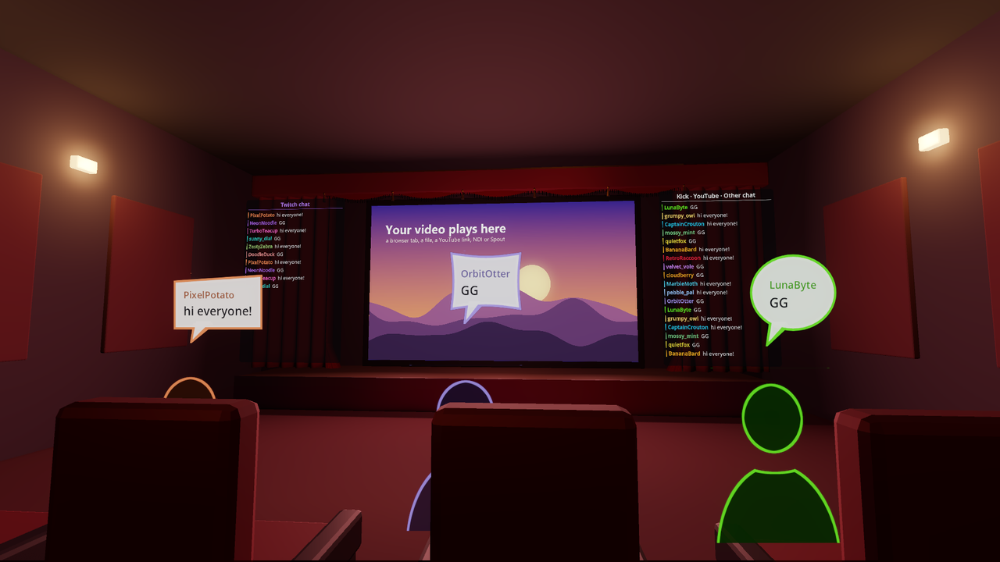

## Contents

**Part 1: Getting started**

- [1. What you need](#1-what-you-need)
- [2. Starting both apps](#2-starting-both-apps)

**Part 2: Stream Rooms**

- [3. The rooms](#3-the-rooms)
- [4. Hotkeys](#4-hotkeys)
- [5. The control panel](#5-the-control-panel)
- [6. Source: what the screen shows](#6-source-what-the-screen-shows)
- [7. Room: look, curtain, cameras, performance](#7-room-look-curtain-cameras-performance)
- [8. React and Sound](#8-react-and-sound)
- [9. Chat windows](#9-chat-windows)
- [10. The audience](#10-the-audience)
- [11. Seating by platform](#11-seating-by-platform)
- [12. Chat reactions and flashing lights](#12-chat-reactions-and-flashing-lights)
- [13. Presenters, name tags and podium pictures](#13-presenters-name-tags-and-podium-pictures)
- [14. Streaming together](#14-streaming-together)
- [15. Accessibility](#15-accessibility)

**Part 3: Stream Core**

- [16. The admin dashboard](#16-the-admin-dashboard)
- [17. Connecting chat platforms](#17-connecting-chat-platforms)
- [18. Points and chat history](#18-points-and-chat-history)
- [19. Chat reactions setup](#19-chat-reactions-setup)
- [20. Chat games](#20-chat-games)
- [21. Commands, credits, alerts and overlays](#21-commands-credits-alerts-and-overlays)

**Part 4: Help**

- [22. Troubleshooting](#22-troubleshooting)
- [23. Quick reference](#23-quick-reference)

---

# Part 1: Getting started

## 1. What you need

- **Windows PC** with a decent graphics card. Stream Rooms is built on Redot (a Godot-based engine) and uses the Forward+ renderer.
- **Stream Rooms**: either the exported folder (`StreamRooms.exe` with its `tools` folder), or the project opened in Redot 26.2.
- **Fridge Stream Core** (optional but recommended): a Python program. It needs Python 3.10 or newer. Without it, Stream Rooms still works, but there is no chat audience, no reactions and no chat games.
- **A browser** (Brave, Chrome or Edge) for the sender page that shares a tab with the game. Firefox can't share tab audio.
- **OBS** (or similar) to capture the Stream Rooms window.
- Optional extras: the **NDI Runtime** for NDI sources, **Spout** output in VTube Studio / OBS / TouchDesigner, and **Tailscale** or the bundled **Cloudflare tunnel** for streaming together.

The `tools` folder holds `ffmpeg.exe` and `yt-dlp.exe` (for videos and YouTube links) and `cloudflared.exe` (for the Cloudflare tunnel). If they are missing, right-click `tools\get_tools.ps1` and pick *Run with PowerShell*. It downloads all three.

## 2. Starting both apps

1. **Start Stream Core** first. Double-click **START Stream Core.bat** (or `start.bat` inside the `fridge-stream-core` folder). A console window opens and stays open while it runs. The first time, run `install.bat` once; it sets Python up and offers a short setup wizard (your Kick channel, admins and an admin password called the *admin token*).
2. **Start Stream Rooms** (`StreamRooms.exe`, or press **F5** in Redot). The control panel shows in the top-left corner.
3. In Stream Rooms, the **Chat** tab should say **Connected to Stream Core**. If you start Core later, Stream Rooms connects by itself.
4. Open the Stream Core dashboard in your browser at `http://127.0.0.1:3850/admin/` and paste your admin token in the header.
5. In OBS, add a **Window Capture** (or Game Capture) of Stream Rooms. Press **F9** to move the control panel into its own window so it never shows on stream, or **F10** for a clean feed.

Both apps only listen on your own PC (`127.0.0.1`). Nothing is opened to the internet unless you host a Together session.

---

# Part 2: Stream Rooms

## 3. The rooms

Pick a room in the **Room** tab, or press **PgUp / PgDn** to step through them. Every room has a main screen, a stage curtain and a set of camera spots (keys **1-9** and **0**).

**Home Theater.** A small cinema with red seats. Chat sits in the rows in front of you, with the chat windows beside the screen.

**Drive-In (1950s).** A night parking lot with a moon, stars, clouds, a pickup with lawn chairs, a concession stand and a projector beam.

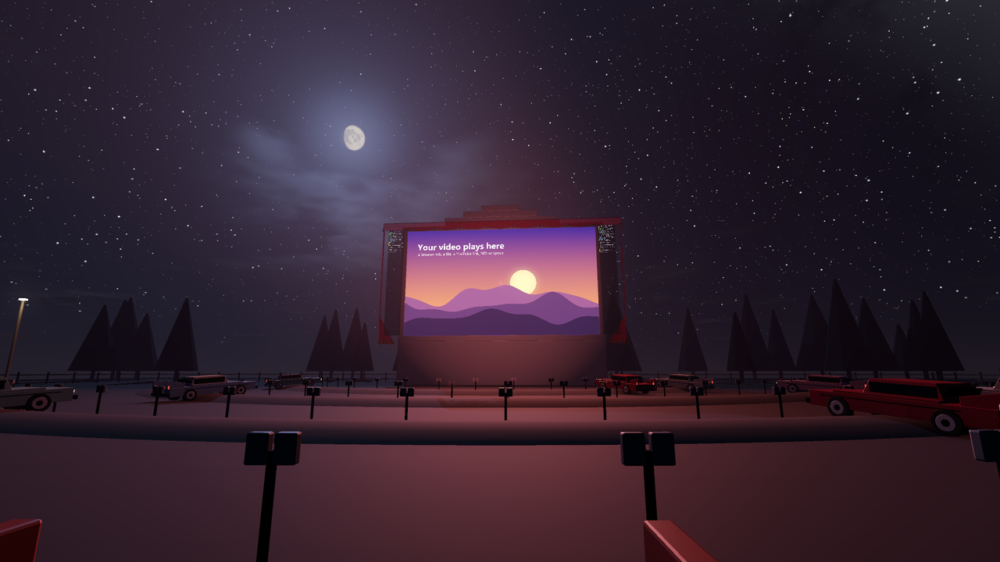

**Neon City (night).** A rain-soaked city avenue. The screen is a giant LED billboard on a tower; every window in every building is a little lit room. The Room tab adds **Rain** and **Hologram** controls here.

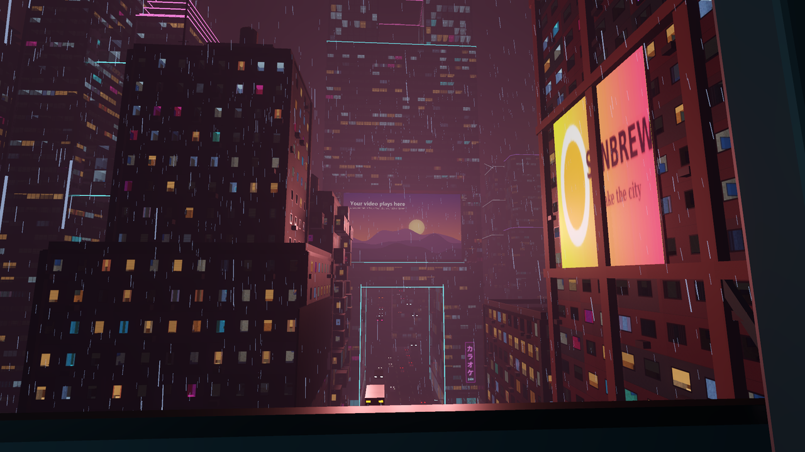

**Old Classroom (film day).** A 1950s classroom with a roll-down screen, a 16 mm projector that whirrs, an old-film look on the picture and a tinny speaker. **Film look** (Room tab) and **Speaker FX** (Sound tab) set how strong the old look and sound are.

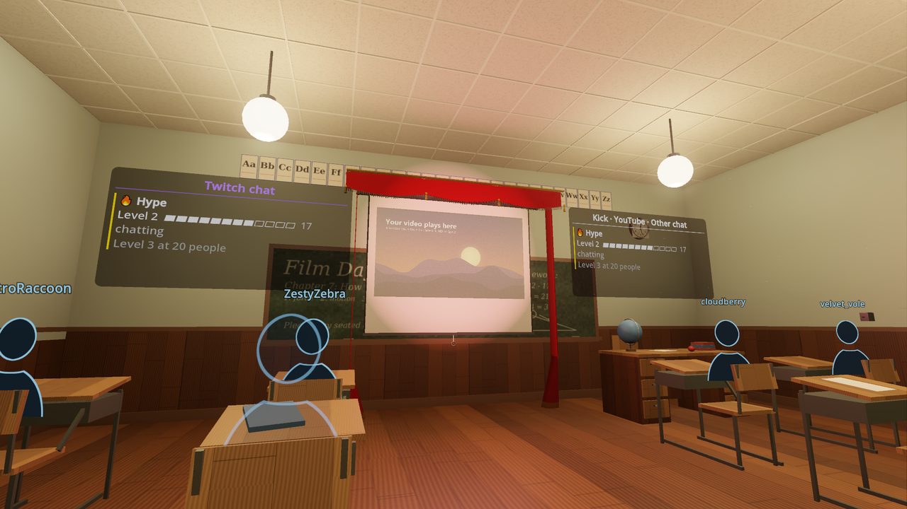

**Lecture Hall.** A Victorian Gothic university theatre in dark oak with stained glass, sunbeams, a ring chandelier, two balconies and a crowd of about 680 extra seats. **Light rays** (Room tab) sets how visible the sunbeams are. It has 12 cameras.

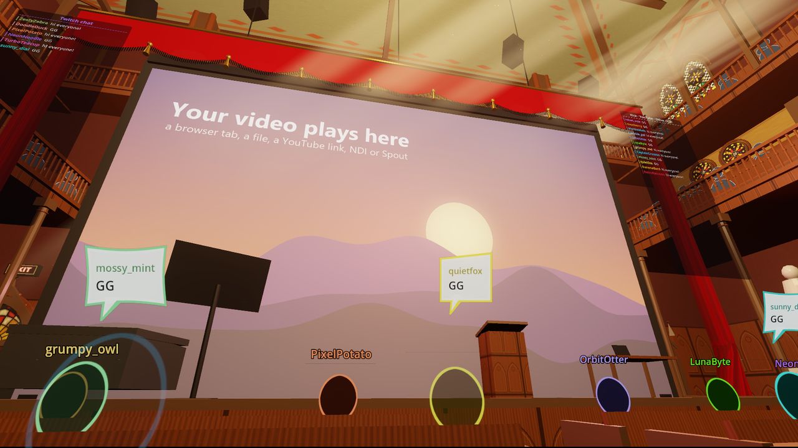

From the balcony you see the *filler crowd*: muted people who sway, dim with the house lights and join in crowd reactions. Your chatters take their places as the room fills.

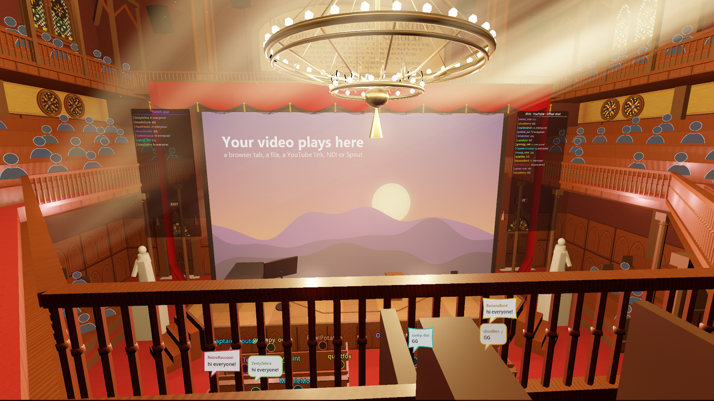

**Lecture Hall (Panel).** The lecture hall with four oak podiums for presenters, a smaller screen higher up, a **chat screen** under the main screen and a **reply screen** above it for Stream Core's answers.

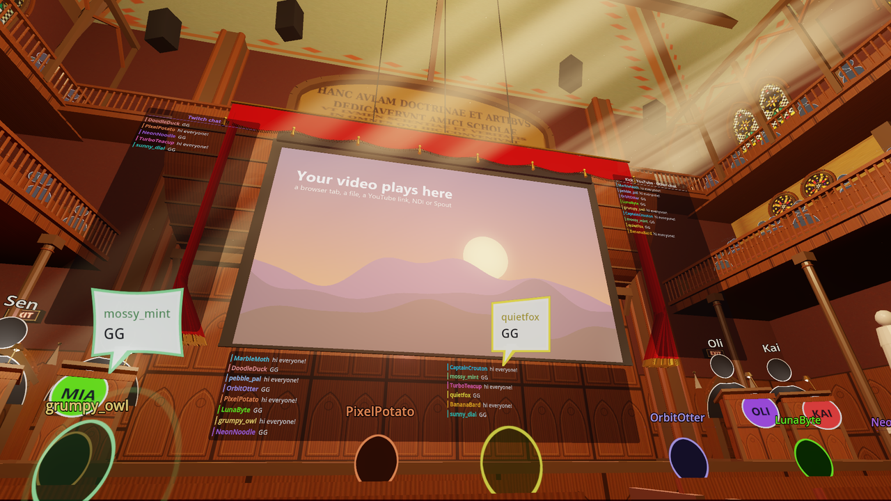

**Studio.** A plain test room without a webcam frame (your webcam shows as a corner overlay there).

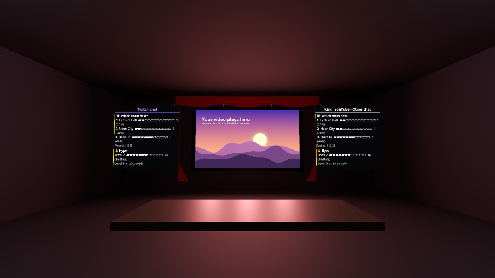

## 4. Hotkeys

| Key | What it does |
|---|---|
| **Tab** | Show / hide the control panel |
| **Space** | Pause to react: pauses the video (or sends Play/Pause to the browser), brings the lights up and moves to the Reaction camera |
| **F** | Focus view: the video flat and full-frame, so viewers can read it |
| **B** / **Shift+B** | Close / open the stage curtain; Shift+B is the big reveal |
| **1-9, 0** | Camera spots (0 is the 10th) |
| **PgUp / PgDn** | Previous / next room |
| **C** / **R** | Chat screen / reply screen on or off (rooms that have them) |
| **F9** | Control panel in its own window, or back |
| **F10** | Clean feed: hides all on-screen UI |
| **F11** | Fullscreen |
| **F6** | Work the panel with the keyboard (Esc leaves) |
| **Ctrl+= / Ctrl+-** | Panel bigger / smaller |
| Hold right mouse + move, **WASD**, **Q/E**, Shift | Free-look camera (Q down, E up, Shift = faster); the mouse wheel while right-dragging zooms |

Hotkeys are ignored while you type in a text box. Press Esc to leave the box.

## 5. The control panel

The panel sits over the room in the top-left corner. Its tabs are **Source, Room, React, Sound, Chat, Audience, Seating, Games, Presenters** and **Together**. Every tab scrolls.

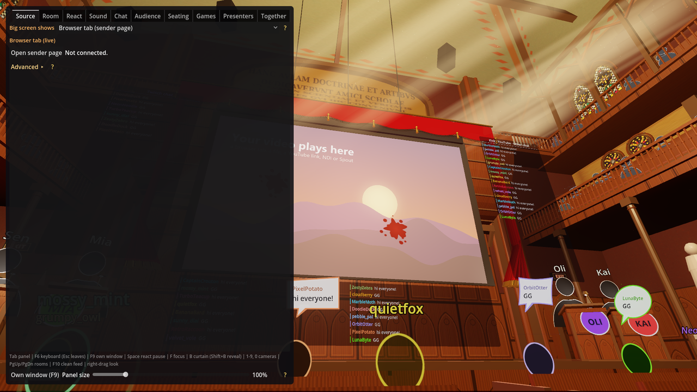

A few things work everywhere in the panel:

- **The yellow ?** beside a setting shows its help as a line of text under it.
- **Click a number** next to a slider (for example *75%*), type a value and press Enter for an exact setting.
- **Own window (F9)** at the bottom moves the panel into a separate window. Put it on your second monitor; then a window capture in OBS never shows it. It remembers where you left it.
- **Panel size** (bottom) makes everything 75% to 200% as big. Ctrl+= and Ctrl+- do the same.
- Settings save by themselves.

## 6. Source: what the screen shows

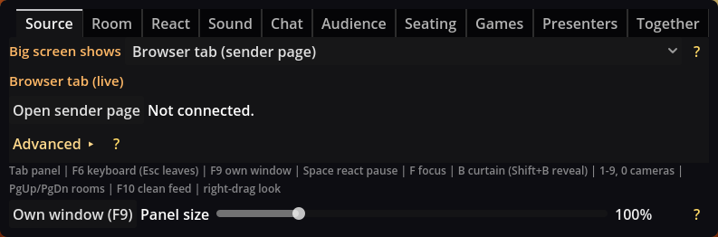

### A browser tab (recommended)

1. Click **Open sender page**. It opens `http://127.0.0.1:8765/` in your browser.
2. Click **Share a tab or window**, pick the tab (for example YouTube) and leave **Share tab audio** on.
3. The tab shows on the big screen within a second or two. Keep the sender page open. It can sit behind other tabs, but don't minimise the whole browser window.

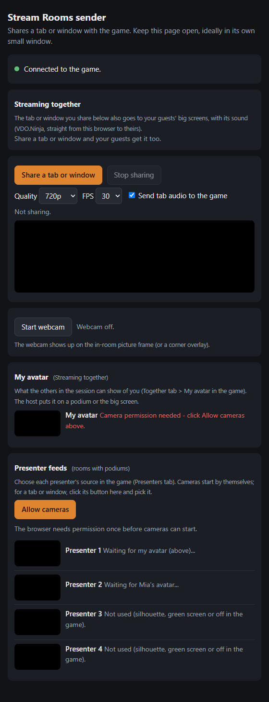

The sender page also has:

- **Quality** and **FPS** for the shared tab, and **Send tab audio to the game**.
- **Start webcam**: your webcam shows on the room's picture frame, or as a corner overlay in rooms without one.
- **My avatar**: when you stream together, it captures the avatar you picked in the Together tab and sends it to the others (see [Avatars](#avatars-on-podiums-and-the-big-screen)). A camera starts by itself; a tab or web page needs a click here.
- **Presenter feeds**: one row per podium for cameras, tabs and web pages (see [Presenters](#13-presenters-name-tags-and-podium-pictures)).
- **Streaming together** status: when you host, it says your guests get your shared tab too.

**Big screen shows** (Source tab, the host in a Together session) puts someone's avatar on the big screen instead, on every PC. See [Avatars](#avatars-on-podiums-and-the-big-screen).

**No double sound.** The sender page asks the browser to silence the shared tab and sends its sound to the game instead. If the browser can't, both the sender page and the Source tab warn you; then mute the tab yourself.

### A video file or YouTube link

Type a file path or a web link under **File or URL** and click **Play**, or click **Browse...**. Links and non-`.ogv` files are converted first with yt-dlp and ffmpeg (the `tools` folder), at the height picked next to **Loop** (720p by default). **Pause / resume**, **Stop** and **Loop** control playback.

### NDI (OBS / NDI Tools)

Lighter than the sender page: OBS does the encoding. Install **DistroAV** in OBS and turn on its NDI output (or add an NDI Filter to one source). Then pick the source under **NDI** and click **Show**. **Stop** lets go.

- **Sound buffer** (default 500 ms) rides out hiccups but puts the sound that far behind. Lower it if lip-sync matters more.
- **Reconnect to the last source by itself** brings it back when OBS starts later.
- Needs the free **NDI Runtime**. Without it, the tab says the plugin isn't loaded and everything else still works.

### Spout (programs on this PC)

Shows another program's picture straight from the graphics card, with no delay or blur, and with transparency: VTube Studio, OBS with the Spout2 plugin, TouchDesigner and some games. Pick the sender under **Spout**, click **Show**. Spout carries no sound. **Show the last sender again by itself** brings it back when the program restarts.

### Lip-sync

The picture takes a longer path than the sound, so the sound is held back 150 ms by default. Change **Audio delay** or **Video delay** in the Sound tab.

## 7. Room: look, curtain, cameras, performance

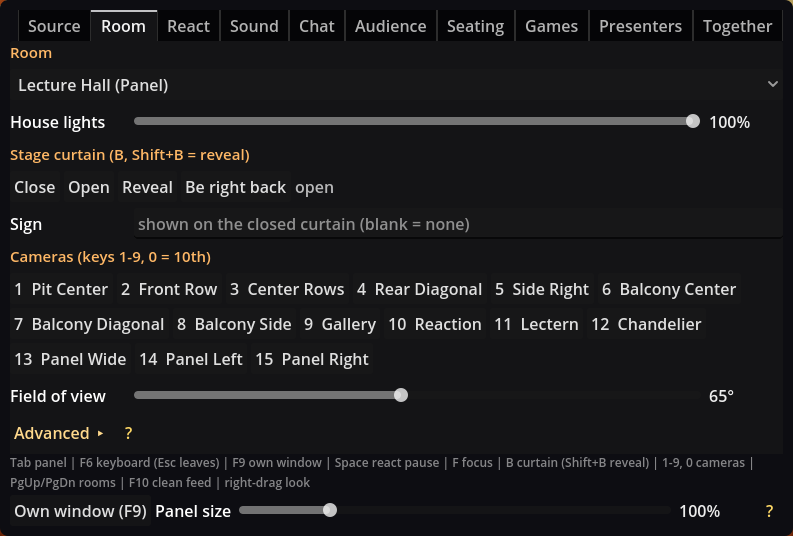

- **Room**: pick the room. **House lights** dims the room's lamps and chandeliers by hand.
- **Room-specific controls** appear here for some rooms: **Light rays** (Lecture Halls), **Rain** and **Hologram** (Neon City), **Film look** (Old Classroom).
- **Cameras**: one button per camera spot, the same as keys 1-9 and 0.
- **Field of view** (25-110°, default 65). **See into the room from outside**: if you fly the camera out through a wall, the wall is cut away instead of everything going black.

### Stage curtain

A red velvet curtain hangs in front of every main screen.

- **Close** (or **B**) hides your screen: the picture, its light on the room and (with **Mute stream sound while closed**) the sound. Focus view shows the curtain too. **Open** opens it.
- **Reveal** (or **Shift+B**): lights down, a spotlight, a drum roll, and the curtain sweeps open.
- **Sign** puts text on a board on the closed curtain. **Be right back** fills in the sign and closes it.
- **Start closed** starts the app behind the curtain, ready for a reveal when you go live.
- **Curtain colour**, **Curtain speed**, **Curtain sounds**, **Reveal dims the lights**, and **Curtain in rooms** (off = no curtain at all).
- Mods can run it from chat with `!curtain open`, `!curtain close` or `!curtain reveal` (chat games on), and you can run it from Stream Core's **Live controls** page.

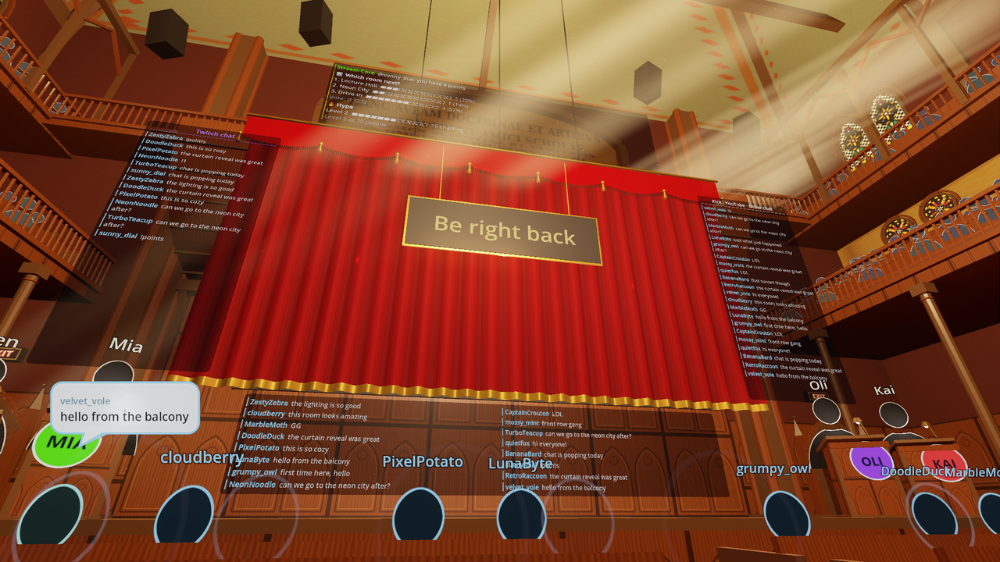

### Performance (this PC)

At the bottom of the Room tab. These are remembered on this PC, not per room.

- **Graphics quality**: **High** (what the rooms are built with), **Medium** (no bounce light, lighter fog and shadows), **Low** (also no fog, ambient occlusion or reflections, and draws the 3D at 75% scaled up with FSR). Changing any of the switches below it makes it **Custom**.
- **Frame rate cap**: 30, 60 (default) or Unlimited. Set it to your stream's frame rate; a 144 Hz screen otherwise makes the graphics card draw far more frames than the stream needs.
- **V-Sync** stops tearing on your own screen.
- **On a laptop**: start on Medium or Low, cap the frame rate, set **Most chatters in crowd** (Audience tab) to about 100-150, run plugged in, and make sure Redot and OBS use the NVIDIA graphics card.

## 8. React and Sound

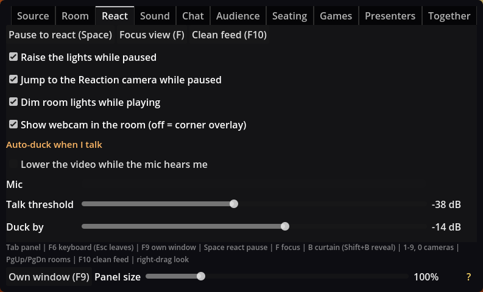

The **React** tab has buttons for **Pause to react (Space)**, **Focus view (F)** and **Clean feed (F10)**, and what a react pause does: **Raise the lights while paused**, **Jump to the Reaction camera while paused**, **Dim room lights while playing**, and **Show webcam in the room** (off = a corner overlay).

**Auto-duck when I talk**: with **Lower the video while the mic hears me** on, the video's sound drops while you speak. Watch the **Mic** meter and set **Talk threshold** just below your speaking level; **Duck by** sets how far it drops (14 dB by default). If starting the microphone ever froze the game, the next start turns this off and tells you; **Start without microphone.bat** next to an exported game does the same on purpose.

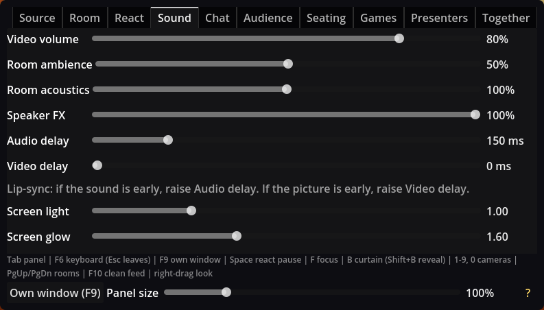

The **Sound** tab: **Video volume**, **Room ambience**, **Room acoustics** (the room's echo), **Speaker FX** (the old speaker sound in rooms that have one), **Audio delay** and **Video delay** for lip-sync, and **Screen light** / **Screen glow** (how strongly the screen lights the room and how bright it is).

## 9. Chat windows

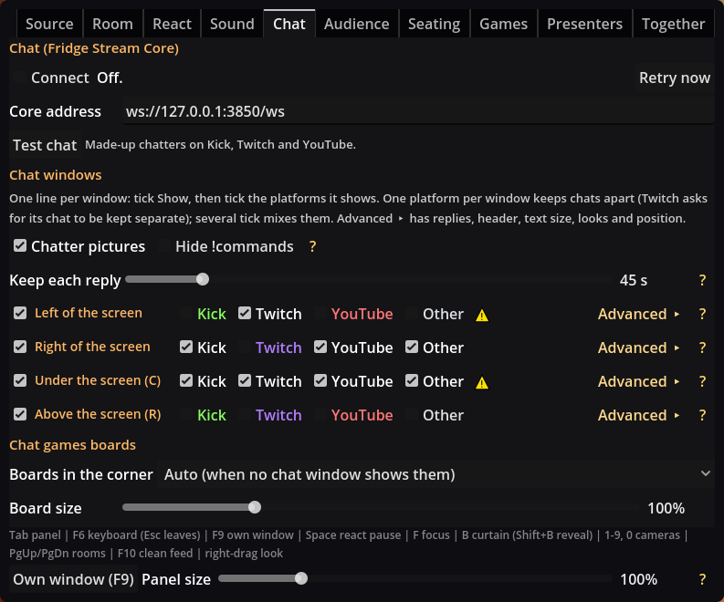

At the top: **Connect** (to Stream Core), the **Core address**, **Retry now** and **Test chat** (made-up chatters, to try things without going live).

Twitch asks for its chat to be kept apart from other platforms' chat, so every chat window picks its own platforms. There are four windows:

- **Left of the screen** and **Right of the screen**: tall windows beside the main screen, in every room. By default the left one shows Twitch and the right one Kick, YouTube and other.
- **Under the screen (C)**: the chat screen (Lecture Hall (Panel)).
- **Above the screen (R)**: the reply screen for Stream Core's answers (Lecture Hall (Panel)).

For each window:

- **Show** turns it on. **▾ settings** folds its settings away.
- **Chat from**: tick one platform for its own window, or several to mix. A warning shows when Twitch is mixed with others.
- **Stream Core replies**: *Off*, *Always*, or *When there's no reply screen*. **Replies to**: *Every platform's chatters* or *Only this window's platforms*.
- **Header**: a title line; leave it empty to name it after what it shows ("Twitch chat").
- **Text size**, **Background**, **Text outline**, and for side windows **Width**, **Height**, **Gap to screen** and **Up / down**. The chat screen also has **Columns**.
- A yellow ⚠ warns when the text would be too small to read on a 1080p stream from the camera in use, and suggests a size.

**Chat games boards**: **Boards in the corner** (auto / always / never) and **Board size**. Polls and other boards go on the reply screen when the room has one, otherwise in the top-right corner.

## 10. The audience

When chat comes in from Stream Core, everyone who chats gets a seat: a head-and-shoulders silhouette in their colour, with their name, and a speech bubble when they talk. Kick and YouTube chatters' profile pictures fill the head. Emotes (Twitch, BetterTTV, FrankerFaceZ, 7TV, Kick, emoji) show in the bubbles, and animated GIF emotes play.

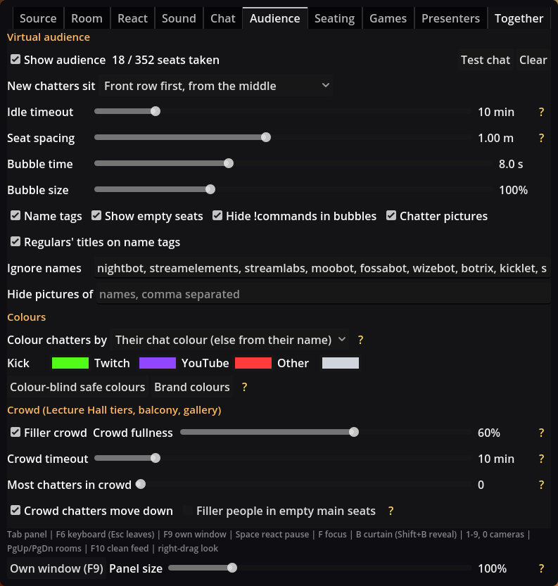

- **Show audience**, and how many seats are taken. **Test chat** fills seats with made-up chatters; **Clear** empties them.
- **New chatters sit**: *Anywhere (random)*, *Front row first, from the middle*, or *Front row first, random seat in the row*.
- **Idle timeout**: minutes without chatting before someone leaves. When every seat is taken, the quietest person makes room.
- **Bubble time**, **Bubble size**, **Name tags**, **Show empty seats**, **Hide !commands in bubbles**, **Chatter pictures**, **Regulars' titles on name tags**.
- **Ignore names**: bots that never get a seat. **Hide pictures of**: names whose picture is never shown.
- **Colour chatters by**: their chat colour, their name, or their platform, with a colour picker per platform. **Colour-blind safe colours** / **Brand colours** switch the platform colours.
- **Crowd (Lecture Hall tiers, balcony, gallery)**: **Filler crowd** and **Crowd fullness**, **Crowd timeout**, **Most chatters in crowd** (0 = no limit; 100-150 on a laptop), **Crowd chatters move down** into free main seats, and **Filler people in empty main seats**.

Silhouettes right in front of the camera fade out so your view stays clear, and bubbles grow with distance so you can read them from the balcony.

## 11. Seating by platform

Keeps each platform's chatters physically apart in the audience.

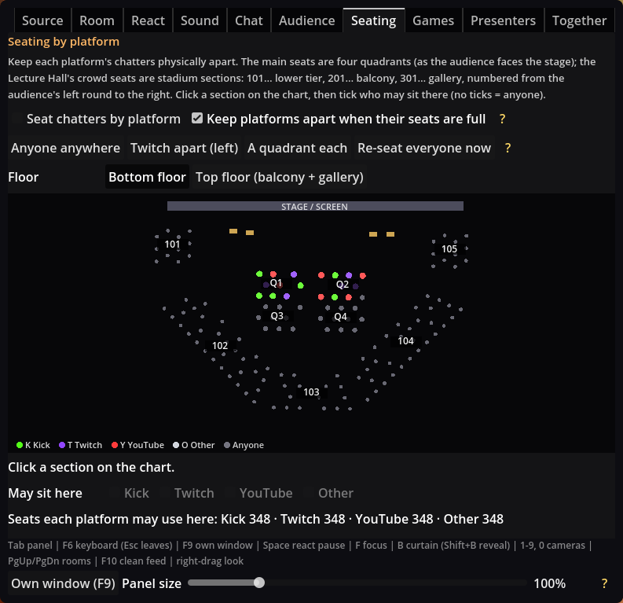

- The main seats are four quadrants as the audience faces the stage: **Q1** front left, **Q2** front right, **Q3** back left, **Q4** back right. The Lecture Hall's crowd seats are sections **101-105** (lower tier), **201-205** (balcony) and **301-305** (gallery).
- Tick **Seat chatters by platform**. Click a section on the chart, then tick who **May sit here** (none ticked = anyone).
- **Keep platforms apart when their seats are full**: on, a chatter waits for a seat in their own sections; off, they sit anywhere free.
- Presets: **Anyone anywhere**, **Twitch apart (left)**, **A quadrant each**. **Re-seat everyone now** moves people already seated.
- **Floor** switches the chart between the bottom floor and the balcony + gallery. Small dots are seats, big dots are chatters, boxes are podiums. Sections are labelled with letters (K, T, Y, O) as well as colours.

## 12. Chat reactions and flashing lights

Chat can throw things at the stage. Typing 🍅 in chat throws a tomato at the screen; `!tomato @name` aims at someone in the audience (their silhouette flinches), `!tomato presenter2` at a presenter, `!tomato podium2` at their podium, `!tomato webcam`, `!tomato chat`. `!targets` lists what the current room has.

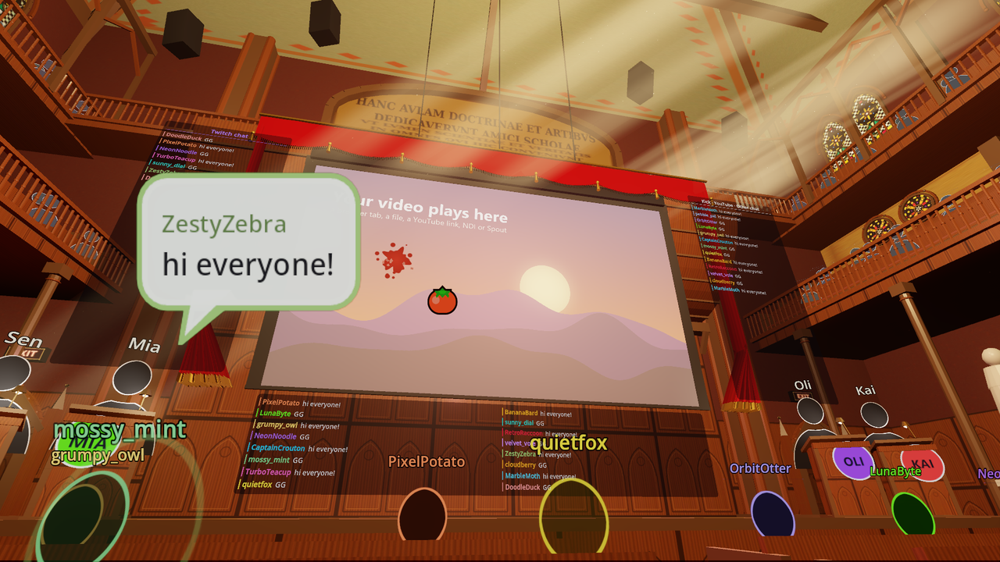

Effects include throws (splat, bounce, stick, shatter), piles on the stage, rain, confetti, wiggles, cheering, the stadium wave, spotlights, room lights, camera shake, signs over heads, seat props (💤 🍿 📱), high fives, seat moves, cartoon stage fire and fireworks. Reactions can also throw pictures (a boot, or pictures you upload to Stream Core).

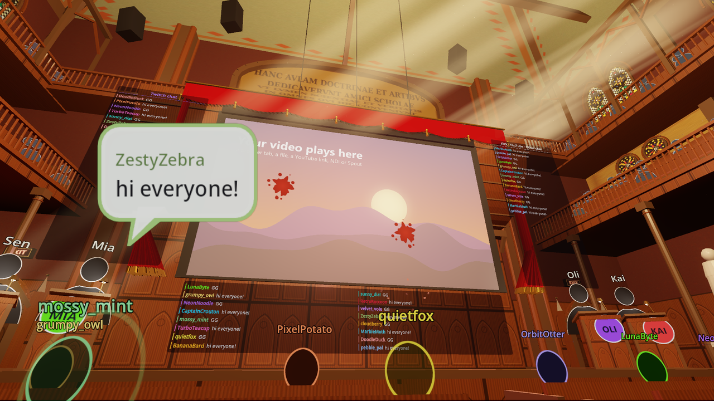

Stream Core decides who may do what (permissions, cooldowns, point costs, opt-outs); Stream Rooms plays it. If the game can't play one (for example reactions are off), Core gives the points back.

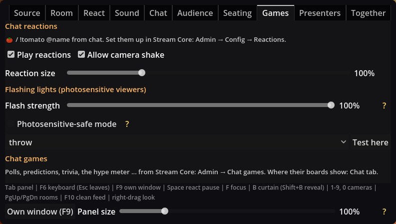

The **Games** tab in Stream Rooms:

- **Play reactions**, **Allow camera shake**, **Reaction size**.
- **Flash strength** (0-100%): how bright flashes, police lights, flicker, fireworks and fire get.
- **Photosensitive-safe mode**: caps flashes at 30%, slows strobes to under 3 a second, makes FLASHBANG a soft swell and turns camera shake off.
- A list of effects with **Test here**, to try any effect in the current room without Stream Core.

## 13. Presenters, name tags and podium pictures

Rooms with podiums (Lecture Hall (Panel)) can show up to four presenters: guests on camera, a vtuber, a PNGtuber page, or a silhouette.

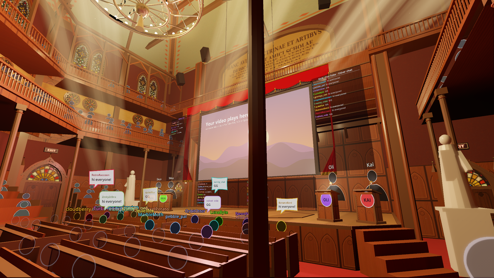

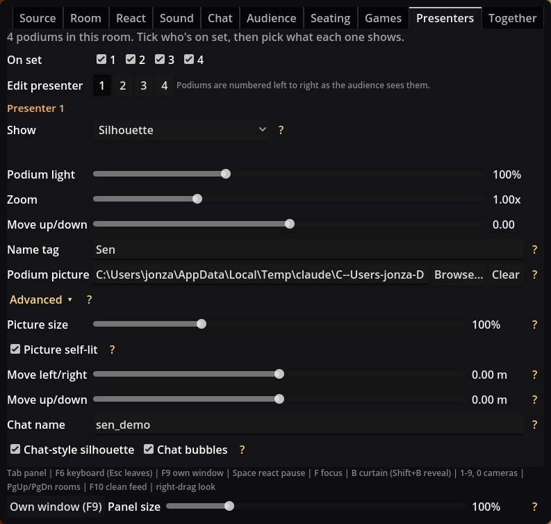

- **On set**: which podiums are used, numbered 1-4 from left to right as the audience sees them. **Edit presenter** picks which one the settings below are for.
- **Show**: *Silhouette*, *Green screen*, *Camera*, *Tab / window*, *Web page (transparent)*, *NDI source*, *Spout (this PC)* or *Someone's avatar (Together)* (with **Whose avatar**; see [Streaming together](#avatars-on-podiums-and-the-big-screen)). The tab only shows the rows that matter for the choice.
- **Camera** (which webcam), **Web page** (the address), or the NDI / Spout source.
- **Self-lit (light panel)** makes the picture glow on its own. **Podium light** is the reading lamp (0-300%).
- **Chroma key** for camera and tab pictures: key colour, **Key similarity**, **Key smoothness**, **Spill removal**. Turn it off for NDI and Spout pictures that already have transparency.
- **Zoom** and **Move up/down** frame the picture.
- **Name tag**: a name above the picture, for example their channel name.
- **Podium picture**: a logo, avatar or badge on the front of the podium. **Browse...** picks a PNG, JPG, WebP or GIF (animated GIFs play), up to 3 MB; **Clear** removes it. **Picture size**, **Picture self-lit**, **Move left/right** and **Move up/down** place it. It sticks to the podium's real front, even a slanted one.
- **Chat name**: their chat name(s), comma separated (`kick:name` only matches on Kick). That chatter sits on the podium instead of in the audience; their throws come from the podium, and their messages pop up over it. **Chat-style silhouette** gives a silhouette their chat colour, picture and name; **Chat bubbles** shows their messages.

Camera, tab and web-page pictures come through the **sender page**:

- **Cameras** start by themselves. The first time, the browser asks for camera permission (**Allow cameras**).
- **Tabs / windows**: click that presenter's **Pick a tab or window** button in the sender page.
- **Web pages (transparent)**, such as a reactive PNGtuber page: in the sender page click **1. Open page** (a small window opens with the page on the key colour), then **2. Share it** and pick the tab called *Presenter N web page*. Magenta (`#ff00ff`) is often a safer key colour than green for colourful avatars.

## 14. Streaming together

Up to four people share one room: a **host** who runs the show and up to three **guests**. Everyone runs their own Stream Rooms, flies their own camera and streams their own view from their own OBS. Only small messages travel between the PCs, so it needs almost no bandwidth (unless you share video, see below).

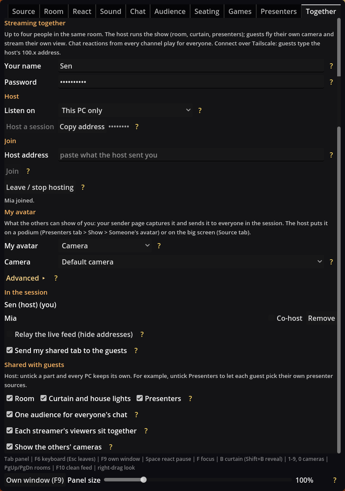

### Connecting

Nobody has to open ports on their router. Pick one way in **Listen on**:

- **Cloudflare tunnel (hide my address)**: hosting gets a one-off `something.trycloudflare.com` address. Nobody sees anybody's real address. The address is new each session, and a brand-new tunnel sometimes needs a second try from a guest.
- **Tailscale (else this PC only)**: everyone joins the host's free Tailscale network.
- **Any network** also lets PCs on your home network in. **This PC only** is for testing two copies side by side.

Then:

1. Everyone types **Your name** and the same **Password** (the host picks it, at least 4 characters).
2. The host clicks **Host a session**, then **Copy address**, and sends the address to the guests in a private message.
3. Each guest pastes it into **Host address** and clicks **Join**.
4. **Both of you confirm.** Once the password checks out, the host gets a popup: "*Name* wants to join your session. Let them in? Nothing is shared until you do.", with **Let them in** and **Decline**. At the same time the guest gets "You're connected to *Host name*. Is that who you meant to join?", with **Yes, join** and **No, leave**. The names are what each person typed in **Your name**, so check them before you say yes.

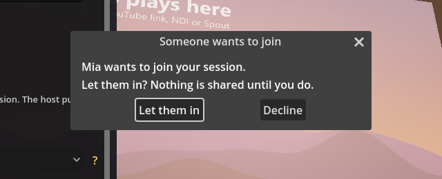

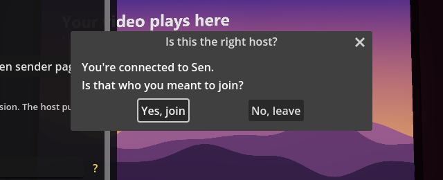

Nothing is shared and nothing syncs until both of you have said yes. Until then the guest waits in line, and the status line on both sides says what it's waiting for. If either of you declines or leaves, or nobody answers within two minutes, the connection closes with a message saying why.

**Leave / stop hosting** ends your part. A wrong password or a different Stream Rooms version is turned away with a message saying why.

**Nothing leaks on stream**: the address is never shown on screen (only dots), and the password never leaves your PC (only a scrambled check of it is sent).

### What's shared

- The **room**, the **stage curtain** and its look, and the **house lights**.
- **Presenters**: who's on set, what they show, name tags and podium pictures. A web page or **Someone's avatar** podium shows for everyone. A podium showing the host's own camera, tab, NDI or Spout only exists on the host's PC, so guests see a silhouette there.
- **Chat reactions** from every channel play for everyone.

Each person keeps their own camera, graphics, sound, chat windows and Stream Core.

**Shared with guests** (host): untick **Room**, **Curtain and house lights** or **Presenters** to let every PC keep its own. Tick it again and the guests get the host's state back.

### Host and guests

Guests can't change shared things; those controls are greyed out. The host can tick **Co-host** next to a guest to let them change the room, curtain and presenters too, or click **Remove**. **Show the others' cameras** shows a small floating camera with each person's name.

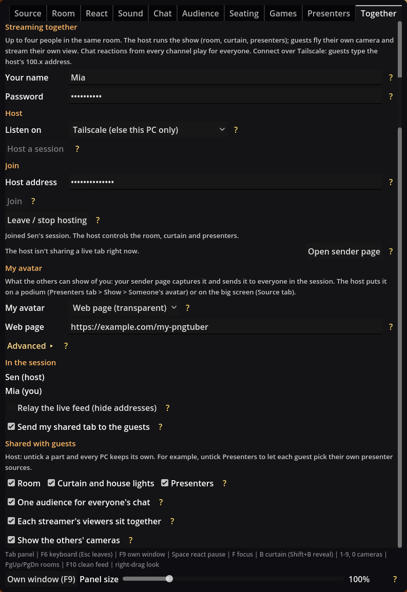

Every guest draws the whole room while streaming. When a guest joins on High or Custom graphics, the tab offers **Use Medium** (or **No thanks**).

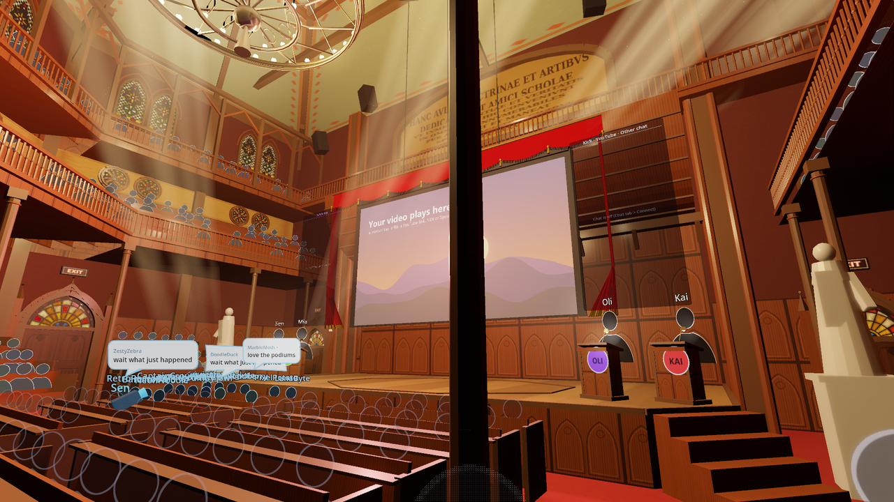

### One audience for everyone's chat

With **One audience for everyone's chat** ticked (host), every streamer's viewers sit in the same audience, and every stream shows the same people in the same seats with the same bubbles. The host's seating settings decide who sits where. **Each streamer's viewers sit together** gives each streamer's viewers their own part of the room (halves for two, quarters for three or four). Each guest's own chat windows still show only their own chat.

### Watching a video together

When the host plays a **web link** in **File or URL**, everyone watches it in sync. Every PC downloads it itself (each needs the `tools` folder), everyone waits on the first frame, and the host starts them all at once. The host's pause, jumps and Stop reach everyone. A video **file** on the host's PC can't reach the guests, so only the host sees it.

### The host's live tab

With **Send my shared tab to the guests** ticked (host), the tab shared in the host's sender page also goes to the guests' big screens with its sound, through VDO.Ninja, straight from browser to browser (about 0.2 to 1 second behind). Guests open their own sender page (the **Open sender page** button in the Together tab) and click **Watch the host's live feed**. **Relay the live feed (hide addresses)** sends it through VDO.Ninja's relay servers instead, so the browsers don't see each other's addresses.

### Avatars on podiums and the big screen

Each person picks **My avatar** in their own Together tab: **Off**, **Camera** (plus which camera), **Tab / window**, or **Web page (transparent)** (plus its address, for example a reactive PNGtuber page). Their sender page captures it in its **My avatar** row and sends it to everyone in the session through VDO.Ninja. A camera starts by itself; a tab or web page needs a click in the sender page.

The host decides where avatars show, and every PC follows:

- **On a podium**: Presenters tab, set a podium's **Show** to **Someone's avatar (Together)** and pick the person under **Whose avatar** (everyone in the session, the host included). The podium's chroma key and other picture settings work as usual.
- **On the big screen**: Source tab, **Big screen shows**: pick a person and their avatar takes the big screen on every PC. It travels at the **Avatars** quality, so pick 720p there for this. **(nobody)** goes back to the host's shared tab.

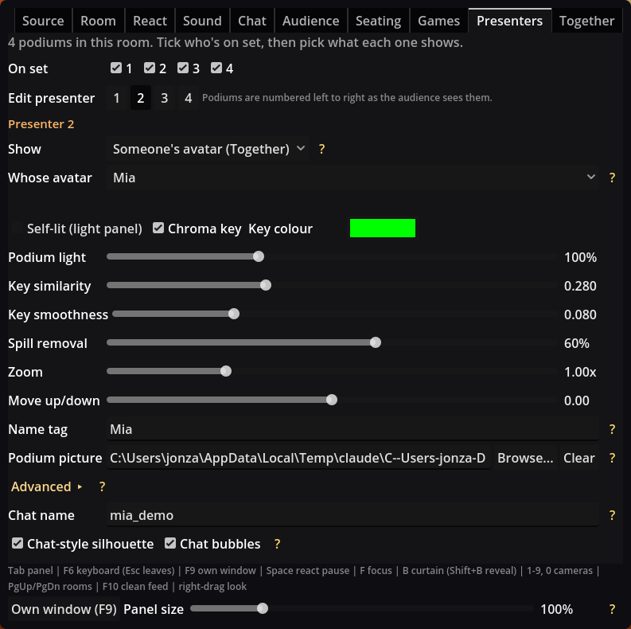

Your own avatar shows on your PC straight from your sender page (nothing travels). If the person isn't in the session right now, their podium waits until they join. NDI and Spout can't travel this way (they live in the game, not the browser); send those to OBS and from there into a web page, for example a VDO.Ninja link.

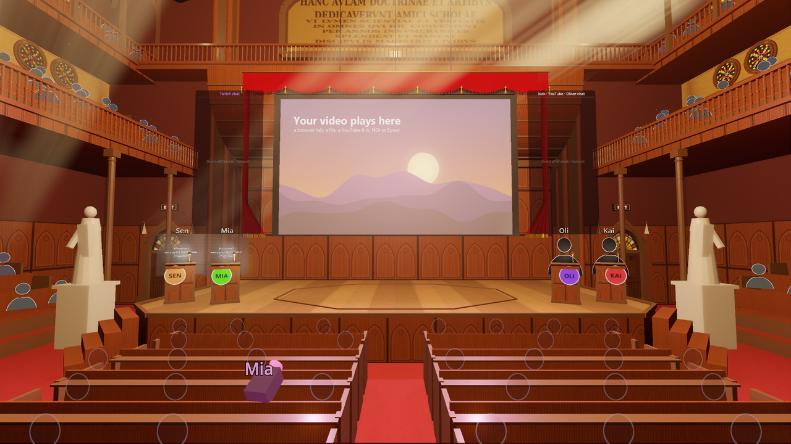

### Quality

The host picks the quality for everyone (everything is sent once per viewer, so lower it on a slow upload):

| Setting | Choices | Rough upload per viewer |
|---|---|---|
| **Big screen to guests** | 480p, 540p, 720p, 1080p | 720p: 3-6 Mbps; 540p: about 2 Mbps |
| **Big screen frame rate** / **bitrate** | 15/30/60 fps; 500-10000 kbps | |
| **Avatars** | 240p, 360p, 480p, 720p | 480p: 0.5-1 Mbps; 240p: 0.2-0.4 Mbps |
| **Avatar frame rate** / **bitrate** | 15/20/30 fps; 100-3000 kbps | |

Changes apply while live.

**A note on copyright**: when several channels watch the same video together, each one is broadcasting it. Only share videos you're allowed to stream.

## 15. Accessibility

- **Panel size** 75-200% (Ctrl+= / Ctrl+-).
- **Keyboard**: **F6** puts the keyboard in the panel (a yellow outline shows where). Tab / Shift+Tab move, Left / Right change sliders or switch tabs, Space / Enter press, Esc gives the keys back to the hotkeys.
- **Help you can see**: the yellow **?** next to settings.
- **Colour**: **Colour-blind safe colours** (Audience tab); section letters on the seating chart; warnings start with ⚠.
- **Chat text**: **Text outline** per chat window, and size warnings for 1080p.
- **Flashing lights**: **Flash strength** and **Photosensitive-safe mode** (Games tab).

---

# Part 3: Stream Core

Stream Core runs in a console window and reads your chat. It sends chat to Stream Rooms (the audience and chat windows), answers chat commands, keeps points, runs chat games and decides which reactions are allowed. Everything is set up in its admin dashboard.

## 16. The admin dashboard

Open `http://127.0.0.1:3850/admin/` in your browser. Paste your **admin token** (from setup, or from `data\admin_token.txt`) into the header and click **Save**. **Connected** in the top right means the dashboard can talk to Core. **High contrast** switches to a high-contrast look.

The menu on the left is grouped into **On stream**, **Overlays**, **Games**, **People** and **Settings**. Every page has its own address, so the browser's Back button works and you can bookmark a page.

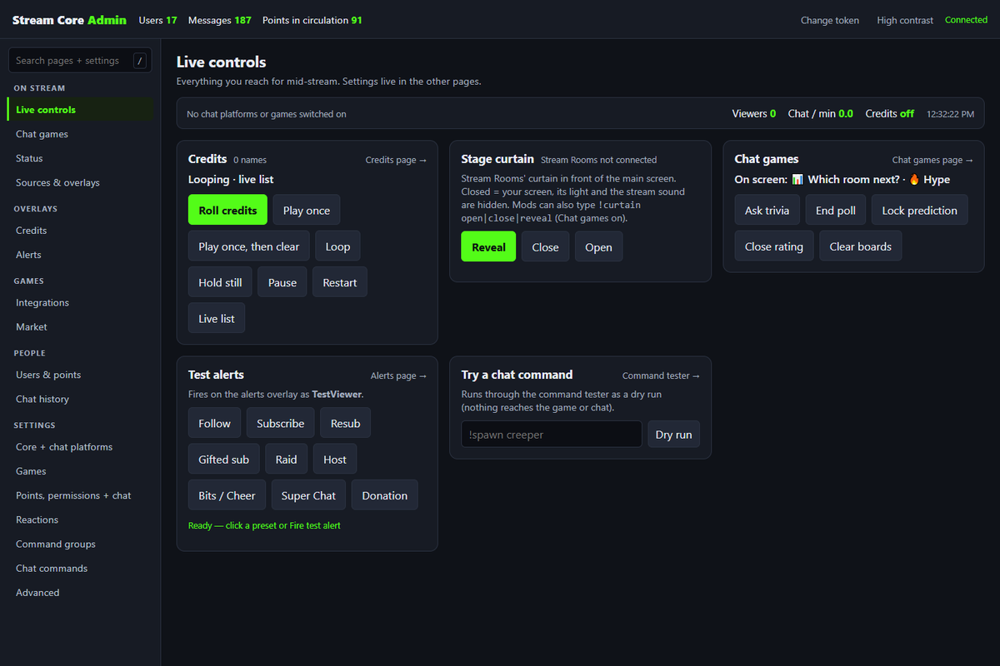

**Live controls** is the page to keep open while you stream:

- **Credits**: roll the end credits, play once, loop, pause, restart.
- **Stage curtain**: **Reveal**, **Close**, **Open** the curtain in Stream Rooms.
- **Chat games**: what's on screen now, and buttons to ask a trivia question, end a poll, lock a prediction, close a rating or clear boards.
- **Test alerts**: fire a follow, sub, raid, Super Chat and so on to the alerts overlay.
- **Try a chat command**: a dry run that reaches neither the game nor chat.

**Search** (press `/`) finds pages and individual settings and jumps to them.

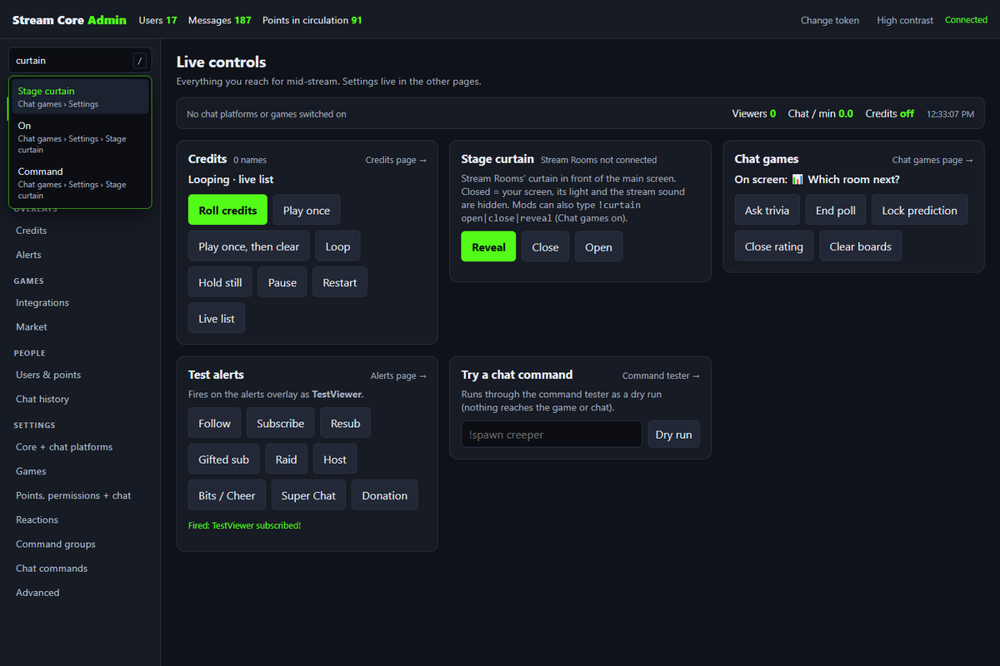

**Status** shows what's running: which chat platforms are connected, the active command groups, points and chat log, and game integrations.

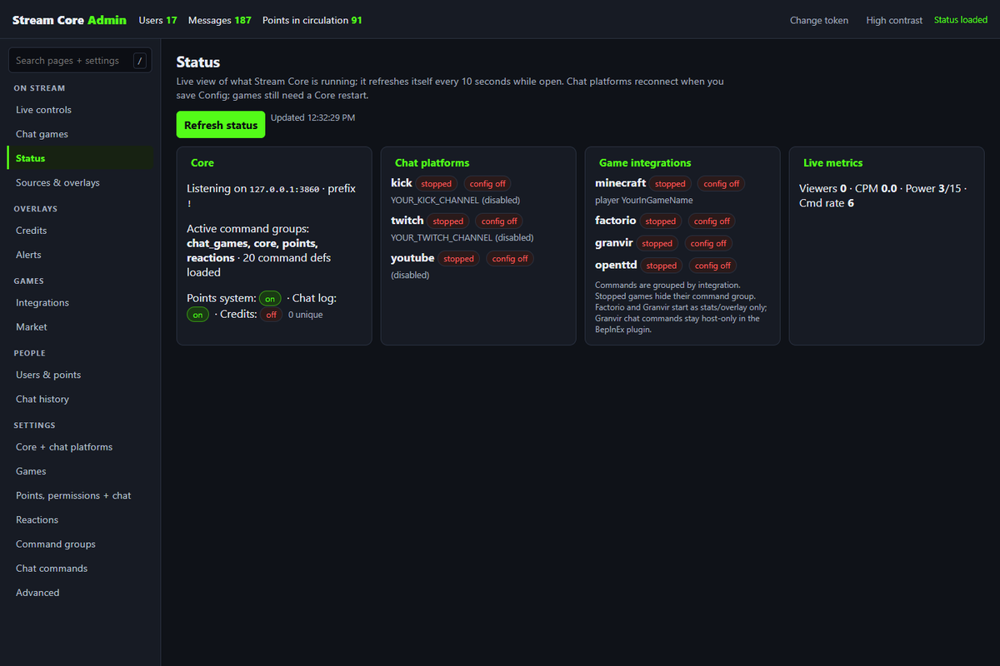

## 17. Connecting chat platforms

All platforms are off until you turn them on. Go to **Settings → Core + chat platforms**, fill in your channels, tick **Enabled** and press **Save & apply**. Chat platforms reconnect straight away; no restart needed.

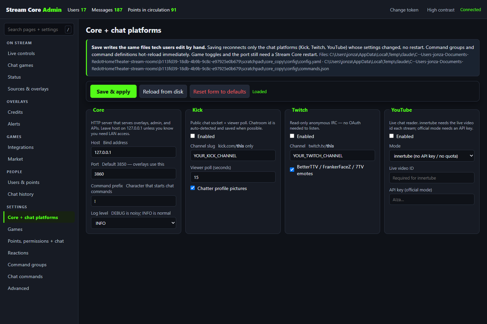

- **Kick**: your channel slug. **Chatter profile pictures** looks each new chatter's picture up once.
- **Twitch**: your channel name. It listens anonymously (no login needed). **BetterTTV / FrankerFaceZ / 7TV emotes** ride along.
- **YouTube**: the live video's id changes every stream. Mode *innertube* needs no API key and has no quota.

Core can read chat on all three, but it can't post into Kick or YouTube chat without a login. That's why its answers show on Stream Rooms' reply screen (and on the replies overlay).

## 18. Points and chat history

**Settings → Points, permissions + chat**:

- **Permissions**: who is an admin and a mod. Plain names match Kick and Twitch; YouTube admins and mods need `youtube:<channel id>` (Core logs the id the first time they chat).
- **Chat points**: points per message, a cooldown against spam, and points for follows, subs and gifted subs. Viewers check theirs with `!points`.
- **Chat history log**: keeps every chat message for the Chat history page and CSV downloads (off by default).
- **Admin token**: the dashboard's password.

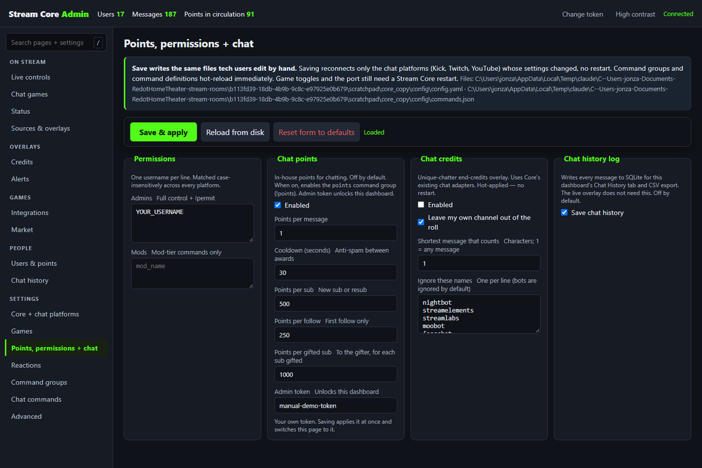

**People → Users & points** lists everyone with their points and linked accounts. Click a person to give or take points, add notes, or link their Kick, Twitch and YouTube accounts so they keep one balance.

**People → Chat history** shows logged messages with search and platform filters, and **Download CSV**.

## 19. Chat reactions setup

**Settings → Reactions** is where you decide what chat can throw and who can do it. Saving applies straight away.

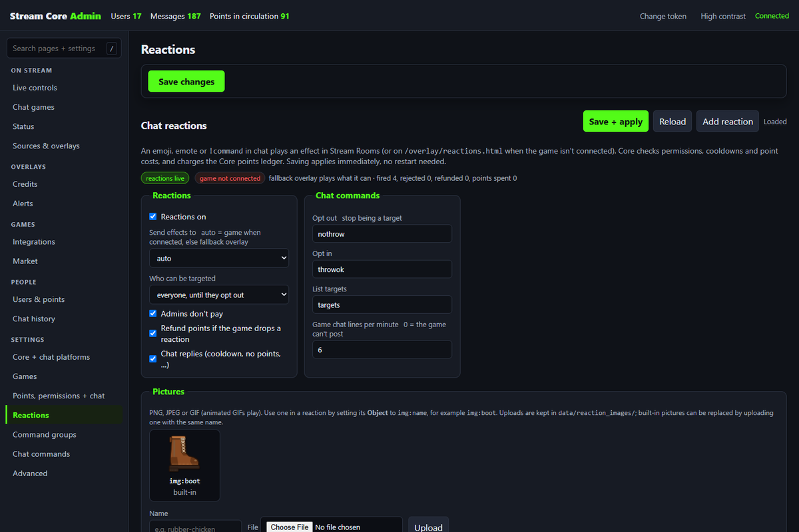

- **Reactions on**, and **Send effects to**: *auto* (Stream Rooms when it's connected, otherwise the fallback overlay), *game* or *overlay*.
- **Who can be targeted**: *everyone, until they opt out* (`!nothrow`) or only people who opt in (`!throwok`).
- **Admins don't pay**, **Refund points if the game drops a reaction**, and **Chat replies** for cooldowns and costs.
- Each reaction has its triggers (emoji, emotes, commands), an effect and its settings, who may use it (public, mod, admin; optionally subs or VIPs), cooldowns, and a point cost (costs need chat points on).
- **Pictures**: upload PNG, JPEG or GIF pictures for reactions to throw. A reaction whose object is `img:<name>` throws that picture.

Built-in reactions include tomatoes, roses, confetti, wiggle, the boot, `!sign <text>`, `!sleep` / `!snack` / `!phone`, `!highfive @name`, and Kick emotes like FLASHBANG, POLICE, ThisIsFine and DonoWall.

## 20. Chat games

**On stream → Chat games**. Tick **Chat games on** on the Settings tab and press **Save + apply**. Games that spend points (predictions, duels, slots, heists, `!claim`, request bumps, `!seat front`) also need chat points on.

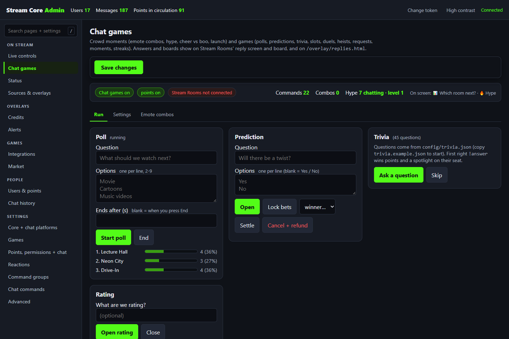

What chat can do:

- **Crowd moments**: emote combos (3+ people using the same mood of emote within 10 seconds make the room react), the **hype meter** (how many people are chatting), `!cheer` / `!boo` tug of war, and `!launch` (5 people start a fireworks sequence).
- **Your seat**: `!seat front`, `!seat back`, `!swap @name`.
- **Games**: `!predict`, `!duel`, `!slots`, `!heist`, trivia, polls (`!1`, `!2`, `!3`), ratings (`!rate 8`), requests, clips / moments, streaks and regulars' titles.
- **Mods start things**: `!poll Question? | A | B | C`, `!predict open Question? | A | B`, `!rate open Title`, and so on. The **Run** tab has the same as buttons.

Boards (polls, predictions, the hype meter, heist crews, trivia) show on Stream Rooms' reply screen, in its top-right corner in rooms without one, and on the replies overlay.

## 21. Commands, credits, alerts and overlays

**Settings → Command groups** turns whole sets of commands on or off (core, points, reactions, chat games, and each game integration).

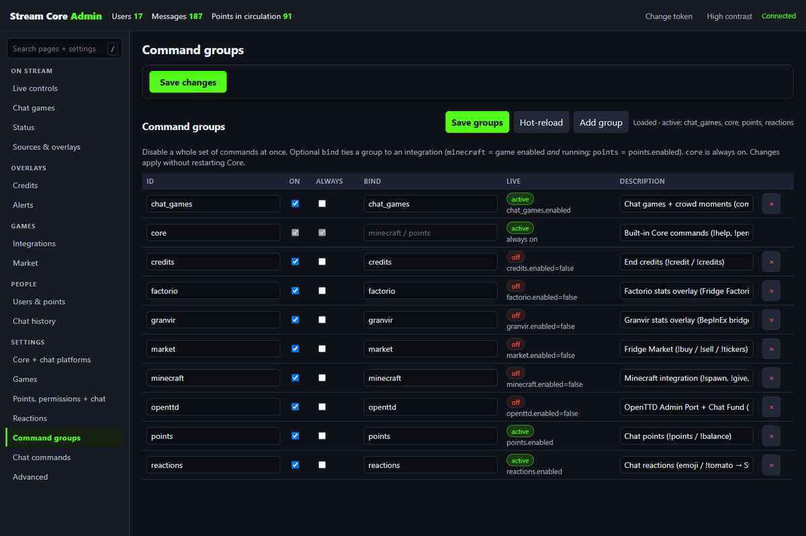

**Settings → Chat commands** lists every command with its group, permission and description; edit, add or delete them. If two commands share a name, the higher priority wins and the clash is shown.

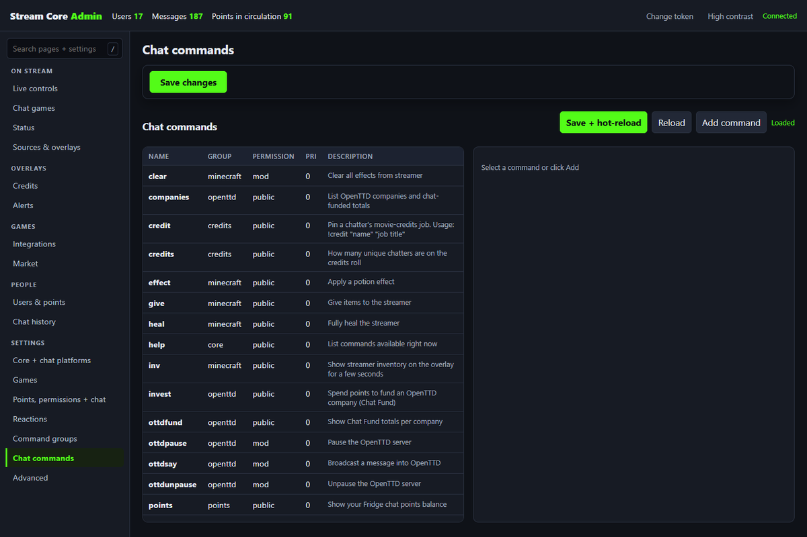

**Games → Integrations** has the **Command tester**: type a command, pick a platform and roles, and **Dry run** (nothing happens) or **Live execute**.

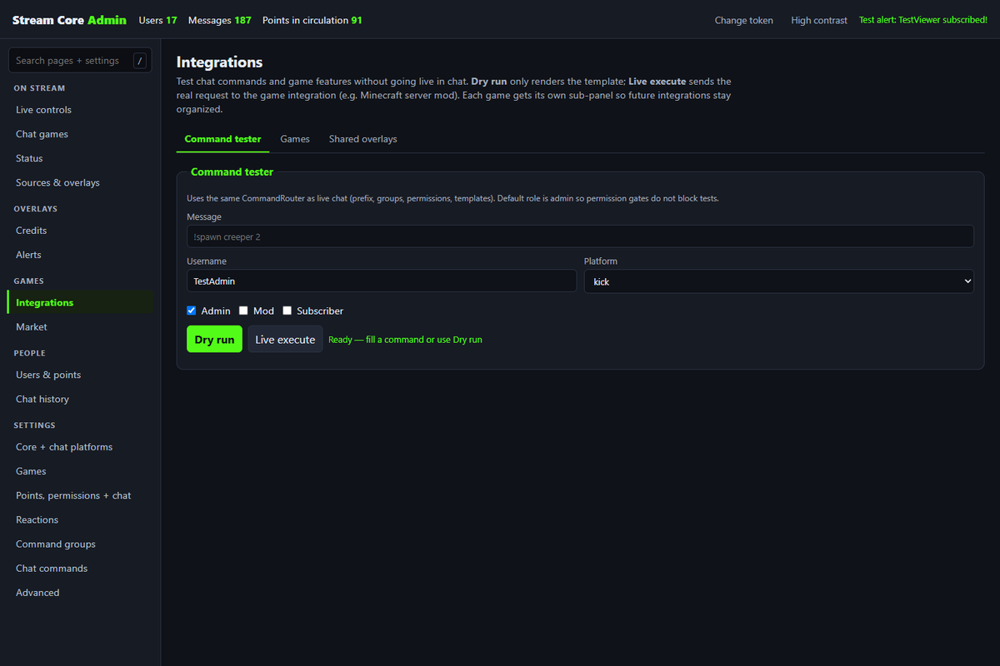

**Overlays → Credits**: end credits listing everyone who chatted. Turn it on, pick a style (nine motions including Star Wars, Teletype and Matrix), and roll it at the end of the stream.

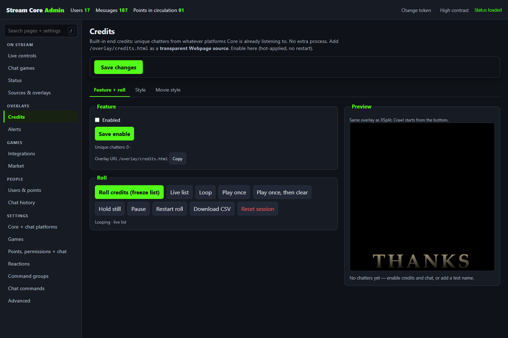

**Overlays → Alerts**: test follow, sub, raid, Super Chat and more without a live event, pick a look, or paste Streamlabs / StreamElements CSS.

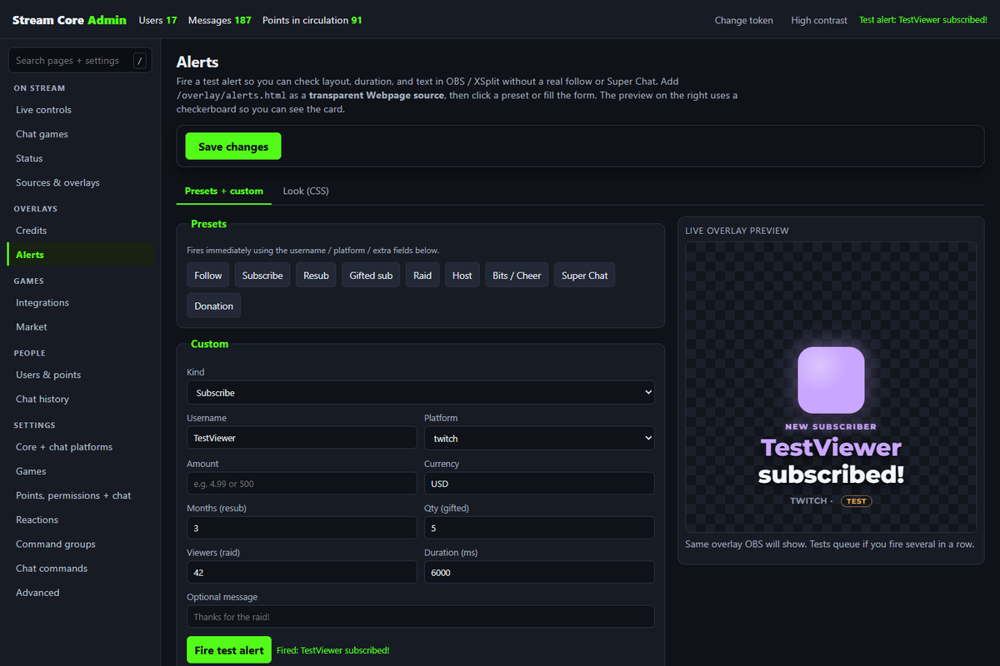

**On stream → Sources & overlays** lists every overlay address with a **Copy** button. Add them to OBS as a **Browser source** with a transparent background:

| Overlay | Address |
|---|---|
| Combined chat (all platforms) | `http://127.0.0.1:3850/overlay/chat.html` |
| One platform | add `?platform=kick` (or `twitch`, `youtube`) |
| Stream alerts | `http://127.0.0.1:3850/overlay/alerts.html` |
| End credits | `http://127.0.0.1:3850/overlay/credits.html` |
| Replies and chat games boards | `http://127.0.0.1:3850/overlay/replies.html` |
| Reactions fallback (when Stream Rooms isn't running) | `http://127.0.0.1:3850/overlay/reactions.html` |

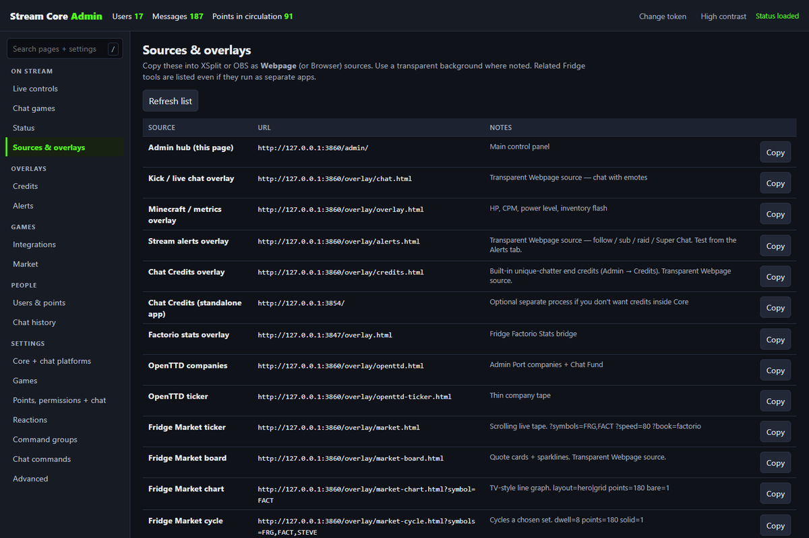

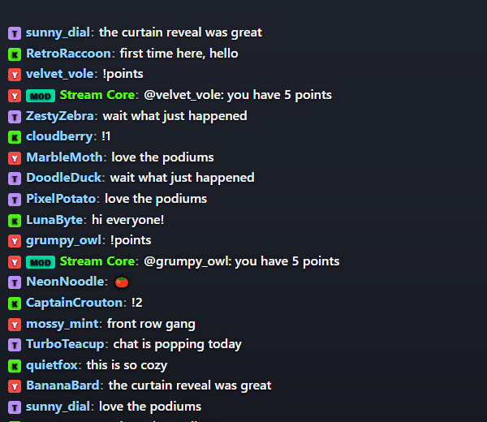

---

# Part 4: Help

## 22. Troubleshooting

| Problem | Try this |
|---|---|
| The Chat tab says it isn't connected | Start Stream Core. Check **Core address** is `ws://127.0.0.1:3850/ws`. Click **Retry now**. |
| Nobody sits in the audience | **Show audience** on (Audience tab); a room with seats (Home Theater, Lecture Halls, Old Classroom); the chatter isn't in **Ignore names**. Try **Test chat**. |
| Tomatoes don't fly | **Play reactions** on (Games tab); **Reactions on** in Stream Core; the reaction's permission and cooldown; points if it costs any. |
| The shared tab doesn't show | Keep the sender page open and don't minimise the browser window. Check the sender page says **Connected to the game**. |
| I hear the video twice | The browser couldn't silence the tab: mute the tab in the browser. |
| Sound and picture are out of step | Sound tab: **Audio delay** if the sound is early, **Video delay** if the picture is early. |
| Choppy on a laptop | Room tab: **Graphics quality** Medium or Low, **Frame rate cap** 60 or 30; Audience tab: **Most chatters in crowd** 100-150. |
| The game froze when the mic started | The next start turns auto-duck off by itself. Or use **Start without microphone.bat**. |
| A guest can't join | Same **Password** and same Stream Rooms version. With the Cloudflare tunnel, try **Join** again. Check **Listen on**. |
| A guest connects but nothing happens | Both of you must accept the popup (**Let them in** on the host, **Yes, join** on the guest) within two minutes. |
| The dashboard says the token is wrong | Paste the token from `data\admin_token.txt` (or your config) and click **Save**. |
| NDI or Spout says the plugin isn't loaded | Install the NDI Runtime (NDI), or check the `addons` folder is next to the game. Everything else still works. |

Settings and caches live in `%APPDATA%\Redot\app_userdata\Stream Rooms` (exported builds may use a similar folder). Stream Core's settings are in `config\config.yaml` and its data in the `data` folder.

## 23. Quick reference

- **Go live checklist**: start Stream Core, start Stream Rooms, **Open sender page** and share your tab, check the Chat tab says connected, close the curtain (**B**) with a sign, start OBS, then **Shift+B** to reveal.
- **Mid-stream**: **Space** to react, **F** for focus view, **1-9** for cameras, Stream Core's **Live controls** for credits, alerts, the curtain and chat games.
- **Ending**: Stream Core **Credits → Roll credits**, then close the curtain.
- **Ports**: Stream Core 3850; Stream Rooms sender page 8765 / 8766; Together 7350.
