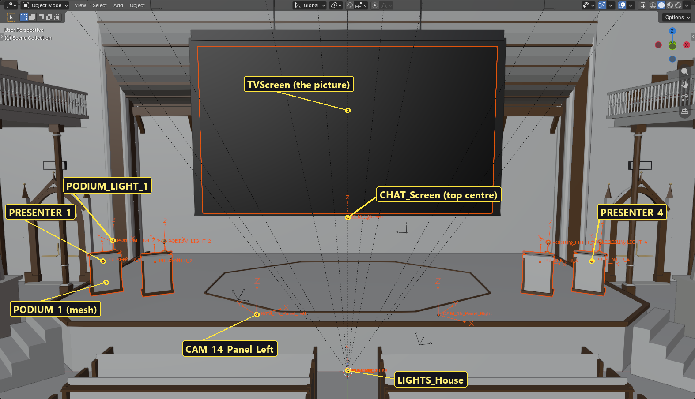
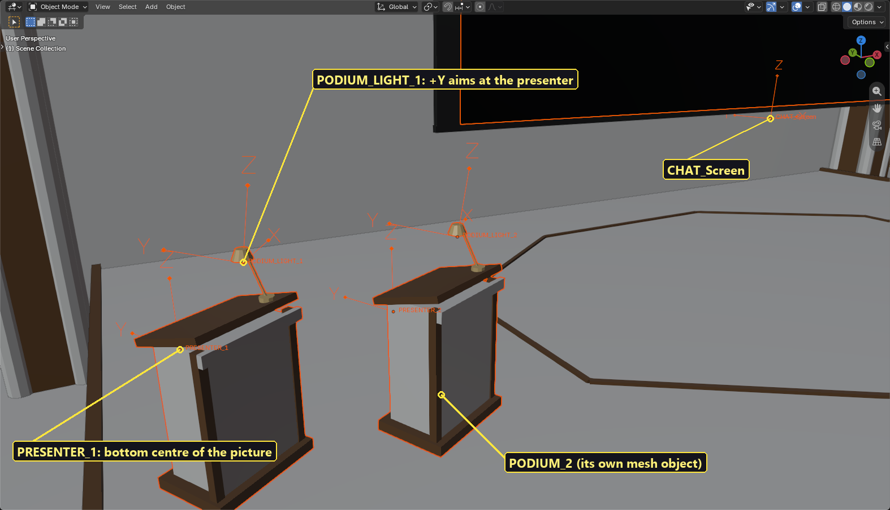

# Building a room: Blender to Stream Rooms

*October 2026. How the Lecture Hall (Panel) was made, step by step, so you can build your own room the same way.*

A Stream Rooms room is a 3D model with a few specially named helpers in it. You build the model in Blender, put **markers** (empties) where the game should add things (the screen, cameras, podiums, chat panels, lamps, seats), export it as a `.glb`, and give the game a small scene and an info file that point at it. The game finds the markers by name when the room loads and builds everything else itself: the picture, the screen light, the curtain, the chat windows, the presenters, the audience and the reaction targets.


## Contents

- [1. How a room fits together](#1-how-a-room-fits-together)
- [2. Set up Blender](#2-set-up-blender)
- [3. Model the room](#3-model-the-room)
- [4. The screen](#4-the-screen)
- [5. Markers: the full list](#5-markers-the-full-list)
- [6. Podiums and presenters](#6-podiums-and-presenters)
- [7. Chat screen, reply screen and curtain](#7-chat-screen-reply-screen-and-curtain)
- [8. Cameras](#8-cameras)
- [9. Lights](#9-lights)
- [10. Audience seats and the crowd](#10-audience-seats-and-the-crowd)
- [11. Export the .glb](#11-export-the-glb)
- [12. Set the room up in Redot](#12-set-the-room-up-in-redot)
- [13. Room settings (the root node)](#13-room-settings-the-root-node)
- [14. Look and sound (room_info.tres)](#14-look-and-sound-room_infotres)
- [15. Test it](#15-test-it)
- [16. Checklist and common mistakes](#16-checklist-and-common-mistakes)

---

## 1. How a room fits together

Each room lives in its own folder, `rooms/<id>/`. The Lecture Hall (Panel) has:

| File | What it is |
|---|---|
| `lecture_hall_panel.glb` | The model exported from Blender, markers included. |
| `lecture_hall_panel_room.tscn` | The room scene: a root node with the room script, the `.glb` inside it, and the audience rows. |
| `room_info.tres` | The room's name, which scene to load, its lighting (Environment), echo and screen look. |
| `crowd_seats.json` | Optional: positions of the ~680 crowd seats, written by the Blender script. |
| `*.png` | Textures the `.glb` brought along. |

The room script is `rooms/room.gd` (or a script that extends it, like `rooms/lecture_hall/lecture_hall_room.gd`, which adds the stained glass, sunbeams and room tone). The game lists every folder in `rooms/` that has a `room_info.tres`, so a new room shows up in the **Room** list by itself.

**Where the Lecture Hall comes from.** The hall isn't modelled by hand. `blender/lecture_hall_gen.py` builds it from code: walls, pews, balconies, the screen and every marker. Run inside Blender with `PANEL = True` set first, the same script builds the panel copy (four podiums, a smaller screen hung higher, a chat screen and a reply screen) and exports `rooms/lecture_hall_panel/lecture_hall_panel.glb`. Its source file is `../blender/lecture_hall_panel.blend`. You don't need a script for your own room: everything below works the same with a hand-made model, as long as the names and directions are right.

## 2. Set up Blender

- **Units:** metres (Blender's default). 1 Blender unit = 1 metre in the game. People are about 1.7 m tall; seats are about 0.45 m high.
- **Axes:** Blender is Z-up. The export converts to Redot's Y-up for you. In this guide, directions are given **in Blender** unless they say "in Redot".
- **Where to put the room:** the Lecture Hall puts the origin at the front-centre of the stage on the hall floor, with the audience towards **-Y** and the screen towards **+Y**. Any layout works, but this one keeps the numbers easy.
- **Collections:** keep the model in one collection (the hall uses `Hall`) and the markers in another (`Hall_Markers`). You'll export both together. Anything you don't want in the game (reference images, preview cameras) goes in a third collection you don't export.
- **Empties for markers:** *Add → Empty → Arrows*. Arrows show which way the marker points, which matters for most of them.



## 3. Model the room

Model it as you would any game level, with a few things in mind:

- **Keep it closed.** The camera can fly anywhere, and **See into the room from outside** cuts away walls between the camera and the room. Walls with a proper thickness or at least a back face look best from both sides.
- **Polygon budget.** The Lecture Hall is a big room and still runs smoothly on Medium graphics. Most cost comes from lights and effects, not polygons, but avoid millions of faces in small props.
- **Materials:** use *Principled BSDF* with Base Color, Roughness, Metallic and (for glowing things) Emission. They come through glTF into Redot as standard materials. Image textures come along too. Give materials clear names: the game can swap or dim materials by name later (see [Room settings](#13-room-settings-the-root-node)).
- **Separate objects for parts the game shows and hides**, like each podium (`PODIUM_1` ... `PODIUM_4`).
- **Don't use Blender lights or cameras.** They aren't exported. Lamps and cameras are markers instead (sections 8 and 9).
- **Original designs only.** No copyrighted characters, logos or likenesses on walls, posters or statues.

## 4. The screen

The screen is the one object every room must have.

- Name the object **`TVScreen`** (exactly).
- Make it a single flat rectangle (a plane), 16:9 if you show 16:9 video. The Lecture Hall (Panel) screen is 8.6 m × 4.84 m; the big Lecture Hall's is 14.4 m × 8.1 m.
- **UVs must cover 0 to 1** across the picture: bottom-left of the UV square at the screen's bottom-left as the audience sees it. A plain *Add → Mesh → Plane* rotated upright has this already. If the picture shows mirrored or upside down in the game, flip the UVs.
- The face's **normal must point at the audience** (towards -Y in the Lecture Hall). Turn on *Face Orientation* in the viewport overlays: the front (blue) side faces the seats.
- Its material doesn't matter: the game replaces it with the video.
- Put a frame or wall behind it if you like, but keep the frame 1-2 cm **behind or beside** the picture, never overlapping it, or the edges flicker.

The game sizes the screen lights and the curtain from the screen's size, so a bigger or smaller screen needs no other changes.

**Extra screens** that show the same picture (like the Neon City's street gantry screen): name them `SCREEN_Mirror_<Name>`, with the same UV rule.

## 5. Markers: the full list

Every marker is an empty (or a mesh, where it says so) with an exact name. Spelling and capitals matter. Numbers start at 1.

| Name | What the game does with it | Which way it points (in Blender) |
|---|---|---|
| `TVScreen` (mesh) | Shows the video and lights the room from it. **Required.** | Face normal towards the audience |
| `CAM_<nn>_<Name>` | A camera preset (keys 1-9, 0). Sorted by name, so use two digits: `CAM_01_Pit_Center`. A name containing `Reaction` is the react-pause camera. | Local **+Y** looks at the subject, Z up |
| `LIGHTS_House` | A group: lamps inside it dim while a video plays. | Doesn't matter |
| `LAMP_<Name>` | Inside `LIGHTS_House`: a light the game creates (colour, strength and range set on the room). | Doesn't matter |
| `WEBCAM_Frame` | Where your webcam picture shows (1.2 m wide, centred on the marker). Without it the webcam is a corner overlay. | Local **-Y** towards the viewer |
| `BEAM_Projector` | A projector beam towards the screen, tinted by the picture, visible in fog. | Placed in the projection booth |
| `SCREEN_Mirror_<Name>` (mesh) | Another screen with the same picture. | Face normal towards the viewers |
| `PRESENTER_<n>` (1-4) | A presenter's picture: the marker is the **bottom centre** of the picture. | Local **-Y** towards the audience |
| `PODIUM_<n>` (mesh) | The podium for presenter n; hidden when that presenter isn't on set. Podium pictures stick to its front. | Doesn't matter |
| `PODIUM_LIGHT_<n>` | The podium's reading lamp. | Local **+Y** aims at the presenter |
| `CHAT_Screen` | **Top centre** of the chat panel under the screen. | Local **-Y** towards the audience |
| `REPLY_Screen` | **Top centre** of the reply panel (Stream Core's answers, chat games boards). | Local **-Y** towards the audience |
| `CURTAIN_Main` | Optional: bottom centre of the curtain's opening. Without it the curtain hangs 0.3 m in front of the screen. | Local **-Y** towards the audience |
| `TARGET_<Name>` | A reaction target: `TARGET_Piano` makes `!tomato piano` work. | Local **-Y** towards the audience |
| `AUDIENCE_<Name>` | One chat-audience seat, on the seat surface. | Doesn't matter |

**Why "-Y towards the audience"?** In Redot these markers' **+Z** must face the audience. The glTF export turns Blender's -Y into Redot's +Z, so aiming the marker's -Y arrow at the seats is the same thing. Cameras are the other way round (Redot looks along -Z), so their **+Y** arrow points at what they look at.

**Aiming an empty:** select it, then *Object → Constraint → Track To*, target something in the audience, *Track Axis* **-Y** (or **Y** for cameras and podium lamps), *Up* **Z**; then *Object → Apply → Visual Transform* and delete the constraint. The generator script does the same with its `aim()` helper.

## 6. Podiums and presenters

This is the part that makes the Lecture Hall (Panel) a panel room.



For each podium n (1 to 4, numbered **left to right as the audience sees them**):

1. **`PODIUM_<n>`**: model the podium as its own object with this name. The game hides it when presenter n isn't on set. Its front surface is where a podium picture goes; the game finds that surface itself, so a slanted front works.
2. **`PRESENTER_<n>`**: an empty at the **bottom centre** of where the presenter's picture should stand, just behind the podium, with its -Y arrow towards the audience. In the hall it sits 0.45 m behind the podium and 0.75 m above the stage floor, so the picture shows from the waist up over the desk. The podiums also turn slightly towards the middle of the audience, and so do their markers.
3. **`PODIUM_LIGHT_<n>`** (optional): an empty where the lamp bulb is, with its +Y arrow aimed at the presenter's face (about halfway up the picture). The game puts a light there; **Podium light** in the Presenters tab sets its brightness.

The picture's size is a setting on the room, not in Blender: **Presenter Size** (default 1.3 m × 1.25 m). The **name tag** goes above the picture by itself, and a chatter on the podium (**Chat name**) sits there instead of in the audience.

**Space for the side chat windows.** The chat windows beside the screen stand 0.4 m in front of the curtain. If they cover the outer podiums, set **Presenter Forward** on the room (the panel hall uses 0.6 m) instead of moving everything in Blender; it slides markers, podiums and lamps towards the audience together.


## 7. Chat screen, reply screen and curtain

- **`CHAT_Screen`**: an empty at the **top centre** of where the chat panel should be, just under the screen frame. The panel hangs down from it. Its size is **Chat Screen Size** on the room (default 8.6 m × 1.5 m: the same width as the panel hall's screen). Turn it on in the game with **C** or the Chat tab.
- **`REPLY_Screen`**: an empty at the **top centre** of the reply panel, above the screen. Size: **Reply Screen Size** (default 8.6 m × 1.3 m). **Reply Screen Raise** makes it taller upwards without moving its bottom edge (the panel hall uses 1.3 m). Leave room above the screen's top for it.
- **The curtain** needs nothing: it hangs in front of `TVScreen`, wide enough to clear the picture. It stops above a chat screen and leaves room for a reply screen. Add `CURTAIN_Main` only if you want it somewhere else (for example in a proscenium arch), at the bottom centre of the opening.
- **Webcam:** the panel hall has no `WEBCAM_Frame` (the podiums take the stage), so the webcam uses the corner overlay. Other rooms put it on a monitor or picture frame by the stage, with a `Reaction` camera looking at it.

## 8. Cameras

- One empty per camera spot, named `CAM_01_Pit_Center`, `CAM_02_Front_Row` and so on. The number sets the order (and the hotkey: 1-9, then 0 for the 10th); the rest becomes the button label ("Pit Center").
- Put the empty where the viewer's eyes are: about 1.2 m above a seat surface for a seated view.
- Aim its **+Y** arrow at what it looks at, with Z up.
- One camera with `Reaction` in its name (the hall's `CAM_10_Reaction`) is where the camera jumps when you pause to react. Point it at the webcam frame if the room has one.
- The first camera is where the room starts.
- Chat-audience seats right where a camera sits are skipped, so a seated camera never looks through someone's head.

The panel hall adds three cameras for the stage: `CAM_13_Panel_Wide`, `CAM_14_Panel_Left` and `CAM_15_Panel_Right`.

## 9. Lights

Blender lights aren't exported. Use markers:

- Make an empty called **`LIGHTS_House`** and parent **`LAMP_<Name>`** empties to it, one per lamp (chandelier bulbs, wall sconces, stage lights). The game puts a light at each one, using **Lamp Color**, **Lamp Energy** and **Lamp Range** from the room's settings. They dim while a video plays and follow the **House lights** slider.
- **Glowing materials** (bulbs, an EXIT sign) are emission in the material. To make them dim with the house lights too, list the material names in **Glow Materials** on the room (the hall uses `Bulb` and `Arcade_Glow`).
- If you need different strengths for different lamp groups, a room script can do it (the hall's script has separate chandelier, gallery and stage values), or you can add real lights in the Redot scene under `LIGHTS_House`.
- The screen lights the room by itself.

## 10. Audience seats and the crowd

Chat sits in seats you mark. There are three ways:

- **`AUDIENCE_<Name>` empties** in Blender, one per seat, on the seat surface.
- **AudienceRow nodes** in the Redot scene (this is what the panel hall uses for its pit pews): add a *Marker3D*, attach `core/audience/audience_row.gd`, put it on the seat surface of the first seat and set **Count** and **Spacing** (seats run along the node's local X), or **Offsets** for uneven rows. **Seat Scale** makes people smaller or larger.
- **A big crowd** (the hall's tiers, balcony and gallery): a JSON file of seat positions, set as **Crowd Seats File** on the room. The format is `{"seats": [{"p": [x, y, z]}, ...]}` in Redot's room space (Y up), on the seat surface. Optional extras per seat: `"n": [x, z]` (the way it faces), `"s": "orch" | "bal" | "gal"` (lower tier, balcony, gallery: used by the seating plan) and `"r"` (row, 0 = front). The hall's generator writes this file (`export_crowd_seats()`), converting Blender's (x, y, z) to Redot's (x, z, -y).

The filler crowd sits in the crowd seats and costs one draw for all of them, so hundreds of crowd seats are fine. The seating chart works out rows and quadrants from where the seats are relative to the screen, so it works in any room.

## 11. Export the .glb

1. Select everything in the model and marker collections (and nothing else).
2. *File → Export → glTF 2.0 (.glb/.gltf)*.
3. Settings:
   - **Format:** glTF Binary (`.glb`)
   - **Include → Limit to:** Selected Objects
   - **Include → Data:** leave Cameras and Punctual Lights off
   - **Transform:** **+Y Up** on
   - **Data → Mesh:** UVs and Normals on; **Apply Modifiers** on
   - **Data → Material:** Export; images Automatic
4. Save it into the room's folder: `rooms/<id>/<id>.glb`.

The Lecture Hall script does exactly this in `export_glb()`. To rebuild the panel hall from the script, open the *Scripting* tab in Blender and run:

```python
PANEL = True
exec(open(r"C:\Users\jonza\Documents\RedotHomeTheater\blender\lecture_hall_gen.py").read())
build_all(); export_glb()
```

`build_all()` also writes `crowd_seats.json` next to the `.glb`.

After exporting again, Redot re-imports the file by itself when its window gets focus. The room scene picks up the changes, and anything you added in Redot (audience rows, settings) stays.

## 12. Set the room up in Redot

1. **Make the folder** `rooms/<id>/` (for example `rooms/my_studio/`) and put the `.glb` in it. Redot imports it. The default import settings are right: leave **Light Baking** on Static (for the bounce light) and **Generate LODs** on.
2. **Make the room scene.** *Scene → New Scene*, root type **Node3D**, name it after the room. In the Inspector, set its **Script** to `res://rooms/room.gd` (or your own script that starts with `extends Room`). Drag the `.glb` from the FileSystem dock onto the root, so it's a child (the hall calls it `Model`). Save as `rooms/<id>/<id>_room.tscn`.
3. **Add audience rows** if you want them (section 10).
4. **Make the info file.** In the FileSystem dock, right-click the folder → *Create New → Resource...* → **RoomInfo**, save it as `room_info.tres`. Fill in:
   - **Id**: the folder name (`my_studio`)
   - **Display Name**: what the Room list shows
   - **Scene Path**: your `_room.tscn`
   - **Sort Order**: where it goes in the list
   - **Environment**: see section 14
5. Save, run the game (**F5**), and pick the room in the **Room** tab (or **PgUp / PgDn**).

When the editor opens a new `.gd` file it makes a `.gd.uid` file next to it: keep it.

## 13. Room settings (the root node)

Click the room's root node; the Inspector shows these (from `rooms/room.gd`):

| Setting | What it does | Lecture Hall (Panel) |
|---|---|---|
| **Presenter Size** | Width and height of each presenter's picture, in metres | 1.3 × 1.25 (default) |
| **Presenter Forward** | Slides presenter markers, podiums and lamps towards the audience | 0.6 |
| **Chat Screen Size** | Width and height of the chat panel | 8.6 × 1.5 (default) |
| **Reply Screen Size** / **Reply Screen Raise** | Size of the reply panel / extra height upwards | default / 1.3 |
| **Crowd Seats File** | The crowd seat JSON (section 10) | `crowd_seats.json` |
| **Side Chat Extra Gap**, **Side Chat Height Scale**, **Side Chat Forward** | Nudges for the chat windows beside the screen (clear of drapes or statues) | defaults in the panel hall (the big hall uses 1.2 m forward, two-thirds height) |
| **Audience Camera Clearance** | Seats closer than this to a camera are skipped | 0.45 m (default) |
| **Dimmed Level** / **Fade Speed** | How far the house lights dim during a video, and how fast | 0.15 / 0.5 |
| **Material Overrides** | Swap an imported material by name for one of your own (for example a shader) | not used |
| **Glow Materials** | Material names whose glow dims with the house lights | `Bulb`, `Arcade_Glow` |
| **Lamp Color / Energy / Range / Shadows** | The lights made at `LAMP_` markers | warm white, 2.0, 20 m |

**Room tab controls of its own.** A room script can add sliders to the Room tab by overriding `get_controls()` (see `rooms/neon_city/neon_city_room.gd` for **Rain**, or the hall's script for **Light rays**). New settings go in `AppState.DEFAULTS`.

## 14. Look and sound (room_info.tres)

- **Environment**: the room's lighting setup. Create a new Environment here and set the sky or background colour, ambient light, tonemap (Filmic or ACES), glow, and the expensive effects the rooms are designed with: **SDFGI** (bounce light), **SSAO**, **SSR** (reflections) and **Volumetric Fog**. The game's **Graphics quality** switch turns those down on slower PCs on top of what you set, so design the room on High. The hall's values are a good starting point: open `rooms/lecture_hall_panel/room_info.tres` and copy them.
- **Screen Light Multiplier** and **Screen Light Range**: how strongly and how far the screen lights the room (the hall: 3.0 and 45 m, because it's huge).
- **Screen Matte**: 0 = black glass (TVs, LED walls), about 0.25-0.7 = a white projection screen that room light washes out a little.
- **Screen LED Amount / Count**: the LED-dot look for big outdoor screens. **Screen Film Amount / Tint**: the old-film look. **Screen Hologram**: adds the hologram controls.
- **Ambience**: a looping sound for the room. **Reverb Room Size / Damping / Wet**: the room's echo (the hall: 0.8 / 0.45 / 0.2). **Speaker Lofi**: an old tinny speaker.

## 15. Test it

1. Run the game and switch to the room. Check:
   - The picture is the right way round (try **Test chat** and a browser tab with text on it).
   - Every camera button works and looks where you meant (**1-9, 0**).
   - The curtain (**B**, **Shift+B**) covers the picture and clears the chat windows.
   - Presenters tab: tick **On set** for each podium; the picture stands behind the right podium, facing the audience, with its lamp on it. Add a **Name tag** and a **Podium picture**.
   - **C** and **R** show the chat and reply screens in the right place.
   - **Test chat** fills the seats; nobody sits inside a wall or a camera.
   - `!targets` (or the Games tab's **Test here** with a throw) hits your `TARGET_` markers.
   - **Graphics quality** Low, Medium and High all look acceptable.
2. Run the regression tests (they write screenshots you can look through):

   ```
   powershell -ExecutionPolicy Bypass -File tools\run_tests.ps1
   ```

3. Fly the free camera out through a wall (hold the right mouse button, WASD) to check the room looks right from outside.

## 16. Checklist and common mistakes

**Checklist**

- [ ] `TVScreen`: one flat face, UVs 0-1, facing the audience
- [ ] `CAM_01_...` and up, +Y aimed at the subject; one with `Reaction` in its name
- [ ] `LIGHTS_House` with `LAMP_` empties inside it
- [ ] Podiums: `PODIUM_n`, `PRESENTER_n` (bottom centre, -Y to the audience), `PODIUM_LIGHT_n` (+Y at the face), numbered left to right as the audience sees them
- [ ] `CHAT_Screen` / `REPLY_Screen` at the top centre of their panels, -Y to the audience
- [ ] Seats: `AUDIENCE_` empties, AudienceRow nodes or a crowd JSON
- [ ] Exported as `.glb`, +Y up, selected objects only, no Blender lights or cameras
- [ ] Room scene with `room.gd` (or a script extending it) and the `.glb` as a child
- [ ] `room_info.tres` with id, name, scene path and an Environment

**Common mistakes**

| What you see | Why, and the fix |
|---|---|
| The room isn't in the Room list | `room_info.tres` is missing, misnamed, or its **Scene Path** is wrong. |
| The screen is black or the picture is mirrored / upside down | The object isn't named exactly `TVScreen`, has no UVs, or the UVs are flipped. |
| A marker does nothing | A typo, or Blender added `.001` to a duplicate name (`PODIUM_1.001`). Rename it. Avoid names ending in `-col`, `-noimp` or similar: Redot's importer treats those suffixes specially. |
| A presenter's picture faces the wall or lies flat | The `PRESENTER_n` empty points the wrong way: its -Y arrow must face the audience, Z up. |
| Camera looks the wrong way | Camera empties aim with **+Y**, not -Y. |
| Podium 1 is on the right | Podiums count left to right **as the audience sees them**. |
| The lamps don't dim | `LAMP_` empties must be children of `LIGHTS_House`. |
| Flickering edges round the screen | The frame overlaps the picture; move it 1-2 cm back. |
| Chat windows cover the podiums | Raise **Presenter Forward**, or nudge the windows with **Side Chat Forward / Extra Gap**. |
| Too dark or too bright | The Environment's ambient light and the `LAMP_` settings; check on Medium too, which has no bounce light. |
